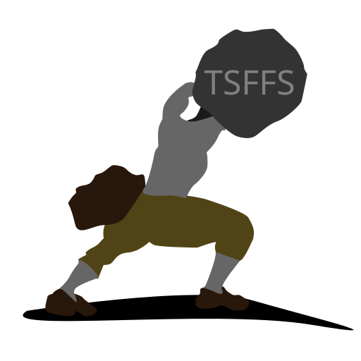

# TSFFS: Target Software Fuzzer For SIMICS

TSFFS is a snapshotting, coverage-guided fuzzer built on the
[SIMICS](https://www.intel.com/content/www/us/en/developer/articles/tool/simics-simulator.html)
full system simulator. TSFFS makes it easy to fuzz and triage crashes on traditionally
challenging targets including UEFI applications, bootloaders, BIOS, kernel modules, and
device firmware. TSSFS can even fuzz user-space applications on Linux and Windows. See
the [requirements](./docs/Requirements.md) to find out if TSSFS can fuzz your code.

- [TSFFS: Target Software Fuzzer For SIMICS](#tsffs-target-software-fuzzer-for-simics)
  - [UEFI Fuzzing Demo](#uefi-fuzzing-demo)
  - [Capabilities](#capabilities)
  - [Documentation](#documentation)
  - [Use Cases](#use-cases)
  - [Setup](#setup)
  - [Running a Simple Sample Target](#running-a-simple-sample-target)
  - [Running an EDK2 Sample Target](#running-an-edk2-sample-target)
  - [Contact](#contact)
  - [Help Wanted / Roadmap](#help-wanted--roadmap)
  - [Why TSFFS](#why-tsffs)
  - [Authors](#authors)

## Capabilities

This fuzzer is built using [LibAFL](https://github.com/AFLplusplus/LibAFL) and SIMICS
and takes advantage of several of the state of the art capabilities of both.

- Edge coverage guided
- Snapshotting (fully deterministic)
- Parallel fuzzing (across cores, machines soon)
- Easy to add to existing SIMICS projects
- Triage mode to reproduce and debug crashes
- Modern fuzzing methodologies:
  - Redqueen/I2S taint-based mutation
  - MOpt & Auto-token mutations
  - More coming soon!

## Documentation

Documentation for this project lives in the [docs](./docs/README.md) directory of this
repository.

## Use Cases

TSFFS is focused on several primary use cases:

- UEFI and BIOS code, particulary based on [EDKII](https://github.com/tianocore/edk2)
- Pre- and early-silicon firmware and device drivers
- Hardware-dependent kernel and firmware code
- Fuzzing for complex error conditions

However, TSFFS is also capable of fuzzing:

- Kernel & kernel drivers
- User-space applications
- Network applications

## Setup

Detailed instructions for setting up and building this project can be found in
[Setup.md](./docs/Setup.md). You should follow the documentation there to set up the
fuzzer before trying to run the sample targets.

## Contact

If you discover a non-security issue or problem, please file an
[issue](https://github.com/intel/tsffs/issues)!

The best place to ask questions about and get help using TSFFS is in the [Awesome
Fuzzing](https://discord.gg/gCraWct) Discord server. If you prefer, you can email the
[authors](#authors). Questions we receive are periodically added from both Discord and
email to the [FAQ](./docs/FAQ.md).

Please do not create issues or ask publicly about possible security issues you discover
in TSFFS. Instead, see our [Security Policy](./SECURITY.md) and follow the linked
guidelines.

## Help Wanted / Roadmap

See the
[issues](https://github.com/intel/tsffs/issues?q=is%3Aopen+is%3Aissue+label%3Afeature)
for a roadmap of planned features and enhancements. Help is welcome for any features
listed here. If someone is assigned an issue you'd like to work on, please ping them to
avoid duplicating effort!

## Why TSFFS

There are several tools capable of fuzzing firmware and UEFI code. Notably, the
[HBFA](https://github.com/tianocore/edk2-staging/tree/HBFA)
project and the [kAFL](https://github.com/IntelLabs/kAFL) project enable system software
fuzzing with various tradeoffs.

HBFA is very fast, and enables fuzzing with sanitizers in Linux userspace. However, it
requires stubs for any hardware interactions as well as the ability to compile code with
instrumentation. For teams with resources to create a working HBFA configuration, it
should be used alongside TSFFS to enable additional error condition detection.

kAFL is also extremely fast, and is hypervisor based which allows deterministic
snapshotting of systems under test. This also makes it ideal for very complex systems
and system-of-systems fuzzing, where interactions between components or the use of real
hardware is necessary. kAFL suffers from a similar limitation as HBFA in that it
requires working device stubs or simulation to be implemented in QEMU, and additionally
requires a patched kernel to run the required KVM modifications.

Both of these tools should be used where possible to take advantage of their unique
capabilities, but TSFFS aims to reduce the barrier to fuzzing low-level systems
software. It is slower (though not unacceptably so) than HBFA or kAFL, and is not (yet)
capable of leveraging sanitizers. In exchange, using it is as simple as adding a few
lines of code to a SIMICS script and ten or less lines of code to your firmware source
code. In addition, because it is based on SIMICS, the tool of choice of firmware
developers, the models and configurations for the code under test can be used as they
are, and developers can continue to use familiar tools to reduce the lift of enabling
fuzzing.

## Authors

Rowan Hart
<rowan.hart@intel.com>

Brandon Marken Ph.D.
<brandon.marken@intel.com>

Robert Geunzel Ph.D.
<robert.geunzel@intel.com>

