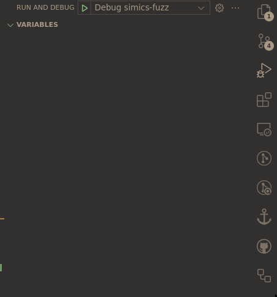

# Debugging the Fuzzer

If you aren't a developer for the fuzzer, please file an issue for any problems you
have that make you want or need to debug the fuzzer. It isn't something most users
should need to do.

## Environment

First, you should be using VSCode with rust-analyzer. You'll also need the CodeLLDB
extension for VSCode, with lldb installed.

## Configuration

We'll debug the `simics-fuzz` binary, although you may need to debug a test in
`simics-tests` or the CLI from `simics-cli`.

Create a CodeLLDB
[configuration](https://github.com/vadimcn/codelldb/blob/master/MANUAL.md#starting-a-new-debug-session)
that looks something like this:


```json
{
    "configurations": [
        {
            "type": "lldb",
            "request": "launch",
            "name": "Debug simics-fuzz",
            "cargo": {
                "args": ["build", "--bin", "simics-fuzz", "--features=6.0.169"]
            },
            "args": [
                "-c",
                "/tmp/newcorpus/",
                "-s",
                "/tmp/newsolution/",
                "-l",
                "DEBUG",
                "-C",
                "1",
                "--package",
                "2096:6.0.70",
                "--file",
                "examples/hello-world/rsrc/HelloWorld.efi:%simics%/targets/hello-world/HelloWorld.efi",
                "--file",
                "examples/hello-world/rsrc/app.py:%simics%/scripts/app.py",
                "--file",
                "examples/hello-world/rsrc/app.yml:%simics%/scripts/app.yml",
                "--file",
                "examples/hello-world/rsrc/minimal_boot_disk.craff:%simics%/targets/hello-world/minimal_boot_disk.craff",
                "--file",
                "examples/hello-world/rsrc/run_uefi_app.nsh:%simics%/targets/hello-world/run_uefi_app.nsh",
                "--file",
                "examples/hello-world/rsrc/run-uefi-app.simics:%simics%/targets/hello-world/run-uefi-app.simics",
                "--command",
                "COMMAND:%simics%/scripts/app.yml"
            ],
            "cwd": "${workspaceFolder}"
        }
    ]
}
```

This specifies the command we'll run, the args to run it, and the cargo command
needed to build it.

## Debugging

To debug, first open the Run and Debug menu in VSCode (the icon is a bug over a play
button). Select your launch configuration in the dropdown like so:



Press the play button at the top and the binary will build and run.