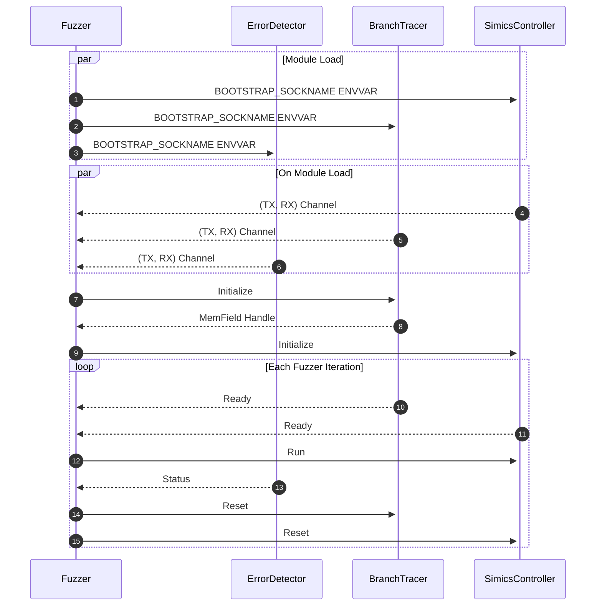

```mermaid
flowchart LR
    MAP_SHM["AFL Map SHM (MemField)"]
    INP_SHM["AFL Input SHM (MemField)"]
    INIT_CORP["Initial Corpus"]

    subgraph Simics
    direction LR
    %% Entries
    BTRACE[Branch Tracer]
    TARG[Target Software]
    IFACE[Simics Control Proxy]
    DETECT[Simics Error Detector]
    %% Links
    TARG-->|Trace|BTRACE
    IFACE-->|Inject Testcase|TARG
    IFACE-->|Snapshot/Run|TARG
    IFACE-->|Reset Snapshot|TARG
    TARG-->|Error/Crash|DETECT
    end


    subgraph Corpus
    direction TB
    %% Entries
    T1[Testcase]
    T2[Testcase]
    T3[...]
    end

    subgraph Fuzzer
    %% Entries
    direction LR
    SCHED[Scheduler]
    EXEC[Executor]
    MUT[Mutator]
    OBS[Observer]
    FEED[Feedback]
    OBJ[Objectives]
    %% Links
    SCHED-->|Next Testcase|MUT
    MUT-->|Mutated Testcase|EXEC
    OBS-->|Observed Map|FEED
    end

    FEED-->|Testcase If Interesting|Corpus

    EXEC-->|Resets Target|IFACE
    EXEC-->|Runs Target|IFACE
    EXEC-->|Current Testcase|INP_SHM
    INP_SHM-->|Current Testcase|IFACE
    BTRACE-->|Populates|MAP_SHM
    MAP_SHM-->|Observes|OBS
    Corpus-->|Next Testcase|SCHED
    INIT_CORP-->|Populates|Corpus
    DETECT-->|Report Event|OBJ
    OBJ-->|Event Triggering Testcase|Corpus
```

```mermaid
sequenceDiagram
    autonumber
    participant F as Fuzzer
    participant E as ErrorDetector
    participant B as BranchTracer
    participant S as SimicsController

    par Module Load
        F->>+S: BOOTSTRAP_SOCKNAME ENVVAR
        F->>+B: BOOTSTRAP_SOCKNAME ENVVAR
        F->>+E: BOOTSTRAP_SOCKNAME ENVVAR
    end

    par On Module Load
        S-->>F: (TX, RX) Channel
        B-->>F: (TX, RX) Channel
        E-->>F: (TX, RX) Channel
    end

    F->>B: Initialize
    B-->>F: MemField Handle

    F->>S: Initialize

    loop Each Fuzzer Iteration
        B-->>F: Ready
        S-->>F: Ready
        F->>S: Run
        E-->>F: Status
        F->>B: Reset
        F->>S: Reset
    end


```