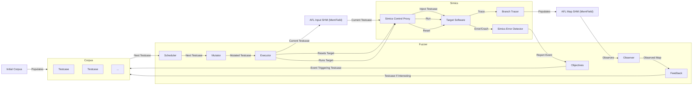

```mermaid
flowchart LR
    MAP_SHM["AFL Map SHM (MemField)"]
    INP_SHM["AFL Input SHM (MemField)"]
    INIT_CORP["Initial Corpus"]

    subgraph Simics
    direction LR
    %% Entries
    BTRACE[Branch Tracer]
    TARG[Target Software]
    IFACE[Simics Control Proxy]
    DETECT[Simics Error Detector]
    %% Links
    TARG-->|Trace|BTRACE
    IFACE-->|Inject Testcase|TARG
    IFACE-->|Run|TARG
    IFACE-->|Reset|TARG
    TARG-->|Error/Crash|DETECT
    end


    subgraph Corpus
    direction TB
    %% Entries
    T1[Testcase]
    T2[Testcase]
    T3[...]
    end

    subgraph Fuzzer
    %% Entries
    direction LR
    SCHED[Scheduler]
    EXEC[Executor]
    MUT[Mutator]
    OBS[Observer]
    FEED[Feedback]
    OBJ[Objectives]
    %% Links
    SCHED-->|Next Testcase|MUT
    MUT-->|Mutated Testcase|EXEC
    OBS-->|Observed Map|FEED
    end

    FEED-->|Testcase If Interesting|Corpus

    EXEC-->|Resets Target|IFACE
    EXEC-->|Runs Target|IFACE
    EXEC-->|Current Testcase|INP_SHM
    INP_SHM-->|Current Testcase|IFACE
    BTRACE-->|Populates|MAP_SHM
    MAP_SHM-->|Observes|OBS
    Corpus-->|Next Testcase|SCHED
    INIT_CORP-->|Populates|Corpus
    DETECT-->|Report Event|OBJ
    OBJ-->|Event Triggering Testcase|Corpus
```