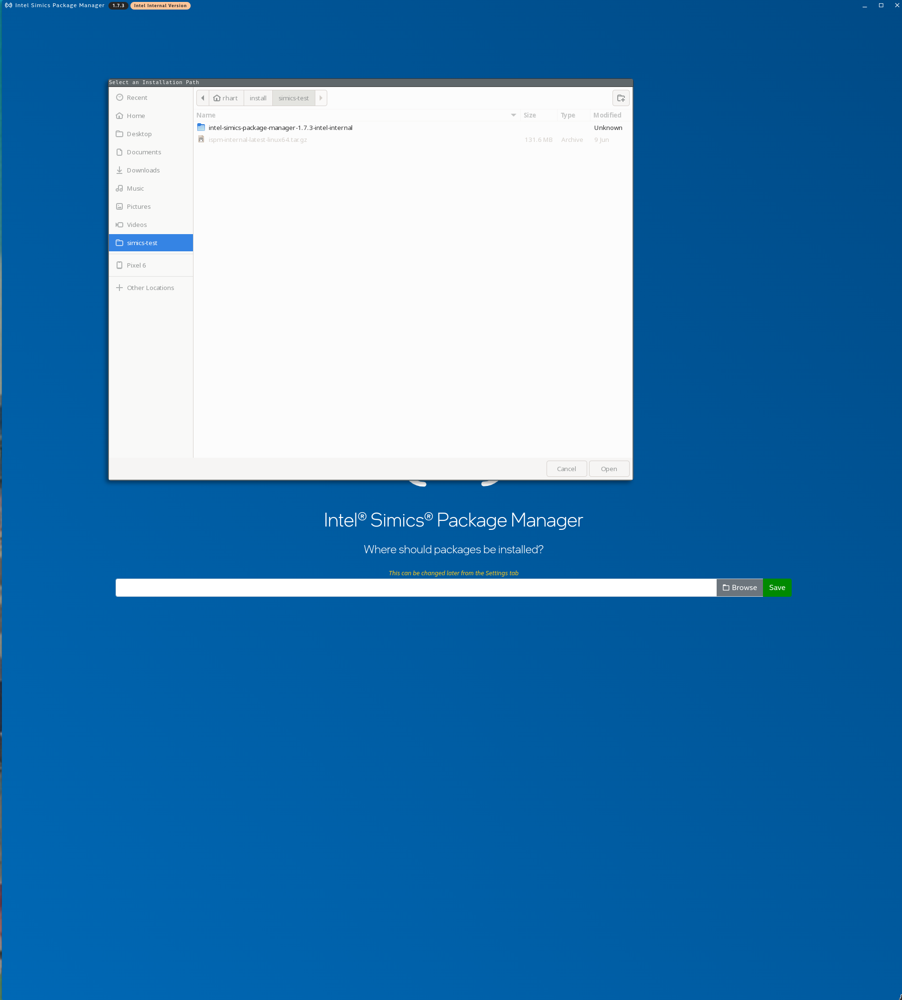
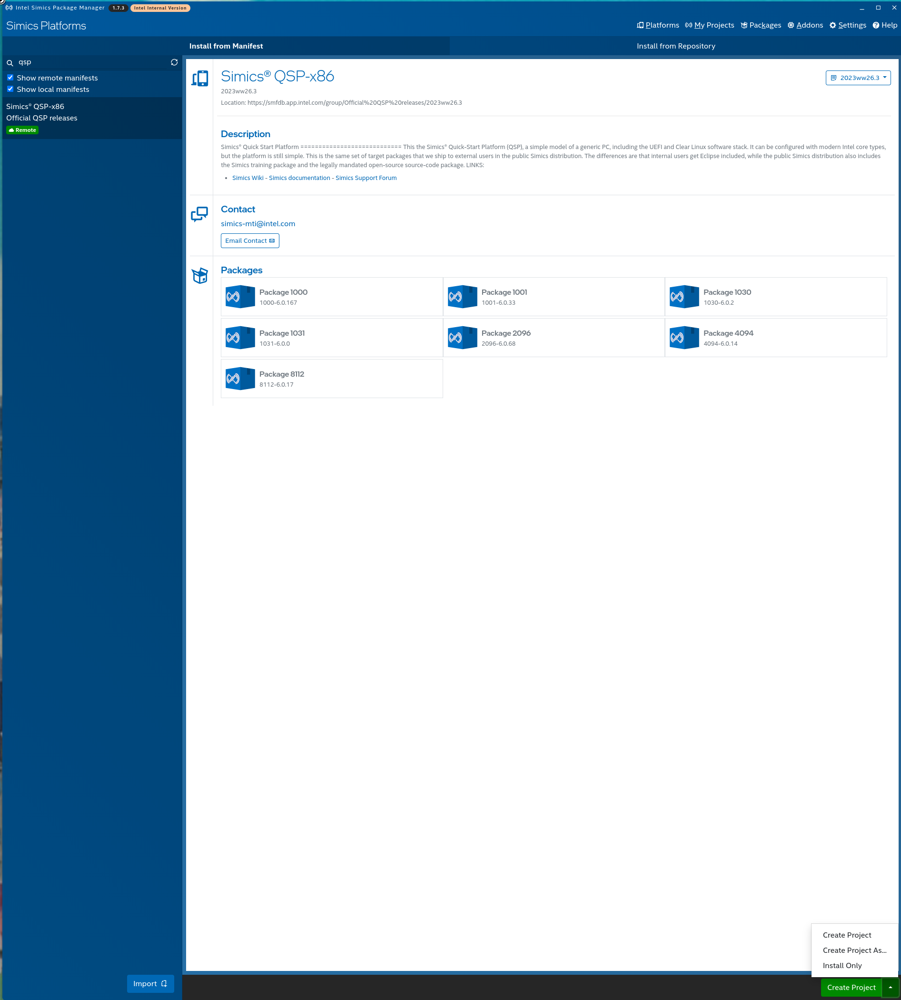
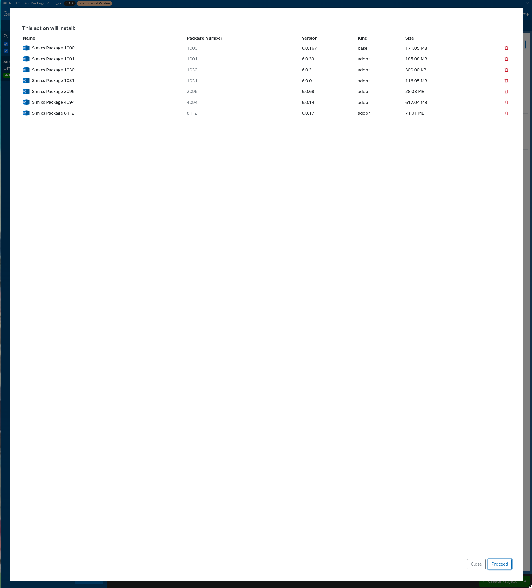
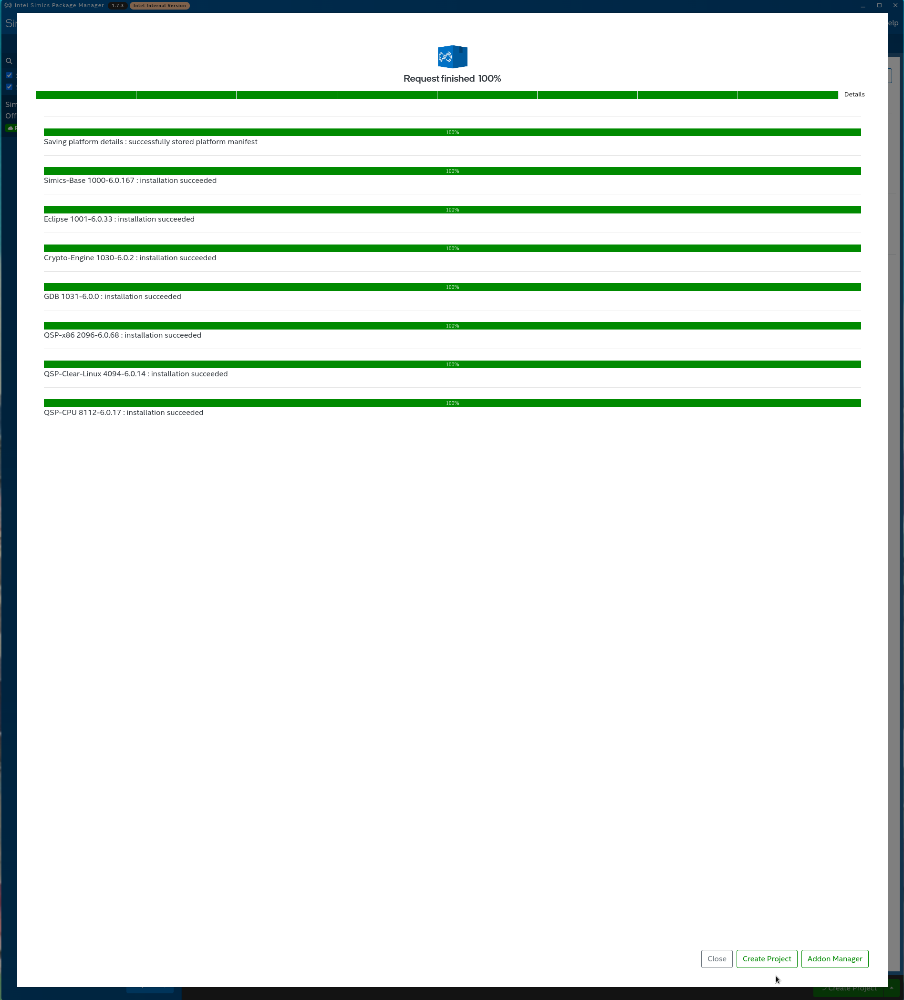

# Setup

Follow these setup steps to prepare this repository to build! If you encounter any
issues during this process, check the troubleshooting section first for common
resolutions.

- [Setup](#setup)
  - [Install Prerequisites](#install-prerequisites)
    - [Rust](#rust)
    - [SIMICS](#simics)
      - [(Optional) Install Simics GUI Dependencies](#optional-install-simics-gui-dependencies)
      - [External Instructions](#external-instructions)
        - [Download Simics (External)](#download-simics-external)
        - [Install Simics (External)](#install-simics-external)
        - [Set up SIMICS\_HOME (External)](#set-up-simics_home-external)
      - [Internal Instructions](#internal-instructions)
        - [Download Simics (Internal)](#download-simics-internal)
        - [Check kinit (Internal)](#check-kinit-internal)
        - [Install Simics (Internal, CLI)](#install-simics-internal-cli)
        - [Install SIMICS (Internal, GUI)](#install-simics-internal-gui)
        - [Set up SIMICS\_HOME (Internal)](#set-up-simics_home-internal)
    - [Docker](#docker)
  - [Build the Fuzzer](#build-the-fuzzer)
  - [Troubleshooting](#troubleshooting)
    - [Troubleshooting Docker Installations](#troubleshooting-docker-installations)
      - [Docker Group Membership](#docker-group-membership)
      - [Docker Proxy Use](#docker-proxy-use)
    - [Troubleshooting Rust Installation](#troubleshooting-rust-installation)

## Install Prerequisites

We need a couple of things before we are ready to build. To set up this workspace,
you'll need `cargo` as well as `simics` with the packages necessary to
run whatever it is you want to run. Here, we'll just install the packages needed to
run the simple samples we provide, but this is where you will want to customize your
installation if necessary.

Docker installation is optional and only needed if you want to build the EDK2 example
targets yourself. The pre-built EFI applications for those examples are provided.

### Rust

You can install the rust toolchain (including `cargo`, `rustc`, etc) from
[rustup.rs](https://rustup.rs) by following the instructions there.

To check that your rust install is working, run:

```sh
$ cargo new --bin /tmp/rust-test
$ cargo run --manifest-path /tmp/rust-test/Cargo.toml
Compiling rust-test v0.1.0 (/tmp/rust-test)
Finished dev [unoptimized + debuginfo] target(s) in 0.50s
    Running `/tmp/rust-test/target/debug/rust-test`
Hello, world!
```

If you see the `Hello, world!` message, your rust installation is complete!

### SIMICS

When building this software, you will need a working SIMICS installation. This document
will walk you through this installation and configuration of this software to utilize
the SIMICS installation.

#### (Optional) Install Simics GUI Dependencies

This step is optional, if you want to use the Simics GUI to install it, you will need
these dependencies.

For Ubuntu or Debian, install them with:

```sh
sudo apt-get install libatk1.0-0 libatk-bridge2.0-0 libcups2 libgtk-3-0 libgbm1 \
    libasound2
```

On Red Hat or Fedora, install them with:

```sh
sudo dnf install atk cups gtk3 mesa-libgbm alsa-lib
```

#### External Instructions

For external users or if you only need externally published Simics packages for your
targets (or you just want to try the external-only samples), you can install Simics
with these instructions.

##### Download Simics (External)

If you only want to test the included samples or you only need to run targets that use
the public Simics packages, you can download Simics from the external intel site on the
[public release page](https://www.intel.com/content/www/us/en/developer/articles/tool/simics-simulator.html).

You will need to download both files (for this section, replace the version with the
version you see on the download page):

- `intel-simics-package-manager-1.5.3-linux64.tar.gz`
- `simics-6-packages-2022-49-linux64.ispm`

In this case, we'll assume you have downloaded both files to the `~/Downloads`
directory, which you can do by running:

```sh
mkdir -p ~/Downloads
wget https://registrationcenter-download.intel.com/akdlm/IRC_NAS/708028d9-b710-45ea-baab-3b9c78c32cfc/intel-simics-package-manager-1.5.3-linux64.tar.gz \
    -O ~/Downloads/intel-simics-package-manager-1.5.3-linux64.tar.gz
wget https://registrationcenter-download.intel.com/akdlm/IRC_NAS/708028d9-b710-45ea-baab-3b9c78c32cfc/simics-6-packages-2022-49-linux64.ispm \
    -O ~/Downloads/simics-6-packages-2022-49-linux64.ipsm
```

##### Install Simics (External)

Assuming the two download locations above, we will install Simics to `~/install/simics`.

```sh
mkdir -p ~/install/simics/
tar -C ~/install/simics -xvf ~/Downloads/intel-simics-package-manager-1.5.3-linux64.tar.gz
~/install/simics/intel-simics-package-manager-1.5.3/ispm packages \
    --install-dir ~/install/simics \
    --install-bundle ~/Downloads/simics-6-packages-2022-49-linux64.ispm \
    --non-interactive
```

##### Set up SIMICS_HOME (External)

In the root of this project, create a file `.env` containing a line like the below that
points to your `SIMICS_HOME` directory (the `--install-dir` argument you passed to
`ispm` in the last step).

```sh
SIMICS_HOME=/home/YOUR_USERNAME/install/simics/
```

#### Internal Instructions

##### Download Simics (Internal)

If you need internal Simics packages, you will need to follow the internal Simics
download and setup processes. In this case, you likely know what packages you need, and
you can obtain the Simics download [here](https://goto.intel.com/simics). If you don't
know what packages you need, or want to run the examples/tutorials only, download the
SIMICS package manager `ispm-internal-latest-linux64.tar.gz` from
[here](https://goto.intel.com/simics).

##### Check kinit (Internal)

When using `ispm` internally, you need to have Kerberos set up for authentication.
Typically this will be done automatically, for example when installing your OS and
configuring it with
[intelize](https://github.com/intel-innersource/applications.provisioning.linux-at-intel.intelize/).

Before running `ispm`, you'll want to initialize Kerberos by running:

```sh
$ kinit
Password for YOU@XXX.XXXX.XXXXX.COM:
```

You can check that you have a valid ticket by running:

```sh
$ klist
Ticket cache: FILE:/tmp/krb5cc_1000
Default principal: YOU@XXX.XXXX.XXXXX.COM

Valid starting       Expires              Service principal
07/20/2023 11:20:34  07/20/2023 21:20:34  krbtgt/XXX.XXXX.XXXXX.COM@XXX.XXXX.XXXXX.COM
        renew until 07/27/2023 11:20:30
```

Kerberos should be working in this case, but please report issues.

##### Install Simics (Internal, CLI)

TSFFS can be built against SIMICS installed either with a CLI or GUI installation of
SIMICS. If you are more comfortable with or used to using the GUI, skip to
[the next section](#install-simics-internal-gui).

Internal Simics installations require you to know which packages you need. If you need
internal packages at all, you likely know the full list. Assuming you downloaded
`ispm-internal-latest-linux64.tar.gz`, you can extract it and install the packages
required to run the samples (Simics-Base and QSP-x86) with the command below. Replace
`1.7.4` with the version of ISPM you downloaded.

```sh
mkdir -p ~/install/simics-internal
tar -C ~/install/simics-internal -xzvf ~/Downloads/ispm-internal-latest-linux64.tar.gz
~/install/simics-internal/intel-simics-package-manager-1.7.4-intel-internal/ispm \
    install \
    --install-dir ~/install/simics-internal \
    --package-repo https://af02p-or.devtools.intel.com/ui/native/simics-local/pub/simics-6/linux64/ \
    1000-6.0.168 \
    2096-6.0.69
```

##### Install SIMICS (Internal, GUI)

If you already installed using the ISPM CLI, skip this step and move on to the
[next](#set-up-simics_home-internal).

After downloading the `ispm-internal-latest-linux64.tar.gz` tarball, create a directory
to install your packages into, and extract ISPM into it, then run the ISPM GUI.

```sh
mkdir -p ~/install/simics-internal
tar -C ~/install/simics-internal -xzvf ~/Downloads/ispm-internal-latest-linux64.tar.gz
~/install/simics-internal/ispm-gui
```

The GUI will open and prompt you to select a directory to install packages into. Select
the directory you just created (`~/install/simics-internal` in this case).



After selecting your install directory, type `qsp` into the search box. This will bring
up a multi-package install with SIMICS Base, QSP-x86, and a few additional pacakges.

In the bottom right corner, select `Install Only` and select the option.



On the next screen, select `Proceed`.



After the installation completes, you'll see all green bars:



Finally, check that all the packages installed:

```sh
$ ls -lh ~/install/simics-test
total 126M
drwxr-xr-x. 1 rhart rhart  752 Dec 31  1969 intel-simics-package-manager-1.7.4-intel-internal
-rw-r--r--. 1 rhart rhart 126M Jun  9 10:44 ispm-internal-latest-linux64.tar.gz
drwxr-xr-x. 1 rhart rhart   86 Jul 19 17:00 manifests
drwxr-xr-x. 1 rhart rhart  312 Jul 19 16:59 simics-6.0.168
drwxr-xr-x. 1 rhart rhart  156 Jul 19 16:59 simics-crypto-engine-6.0.2
drwxr-xr-x. 1 rhart rhart  148 Jul 19 16:59 simics-eclipse-6.0.33
drwxr-xr-x. 1 rhart rhart  152 Jul 19 16:59 simics-gdb-6.0.0
drwx------. 1 rhart rhart    0 Jul 19 17:00 simics-pkg-mgr-tmp-YOUR_USERNAME
drwxr-xr-x. 1 rhart rhart  172 Jul 19 17:00 simics-qsp-clear-linux-6.0.14
drwxr-xr-x. 1 rhart rhart  140 Jul 19 16:59 simics-qsp-cpu-6.0.17
drwxr-xr-x. 1 rhart rhart  168 Jul 19 16:59 simics-qsp-x86-6.0.69
```

##### Set up SIMICS_HOME (Internal)

In the root of this project, create a file `.env` containing a line like the below that
points to your `SIMICS_HOME` directory (the `--install-dir` argument you passed to
`ispm` in the last step).

```sh
SIMICS_HOME=/home/YOUR_USERNAME/install/simics-internal/
```

### Docker

Docker installation is completely optional, and is only needed to manually build the
example EFI applications. Pre-built applications are provided in this repository, so you
can safely skip this step unless you want to modify them or create your own target EFI
applications.

You can find instructions to install docker at
[docs.docker.com](https://docs.docker.com/engine/install). The instructions vary
slightly by distribution, so be sure to follow the directions for your particular Linux
flavor.

After installing docker, you can test that your installation is working by running:

```sh
$ docker run hello-world
Unable to find image 'hello-world:latest' locally
latest: Pulling from library/hello-world
719385e32844: Pull complete 
Digest: sha256:a13ec89cdf897b3e551bd9f89d499db6ff3a7f44c5b9eb8bca40da20eb4ea1fa
Status: Downloaded newer image for hello-world:latest

Hello from Docker!
This message shows that your installation appears to be working correctly.

To generate this message, Docker took the following steps:
 1. The Docker client contacted the Docker daemon.
 2. The Docker daemon pulled the "hello-world" image from the Docker Hub.
    (amd64)
 3. The Docker daemon created a new container from that image which runs the
    executable that produces the output you are currently reading.
 4. The Docker daemon streamed that output to the Docker client, which sent it
    to your terminal.

To try something more ambitious, you can run an Ubuntu container with:
 $ docker run -it ubuntu bash

Share images, automate workflows, and more with a free Docker ID:
 https://hub.docker.com/

For more examples and ideas, visit:
 https://docs.docker.com/get-started/
```

You should see the message that starts `Hello from Docker!`. If you don't, check
[troubleshooting](#troubleshooting-docker-installations)

## Build the Fuzzer

After installing the prerequisites, you can build the fuzzer by running the command
below in the root of the repository.

```sh
cargo build --features=6.0.168
```

## Troubleshooting

### Troubleshooting Docker Installations

#### Docker Group Membership

If you get an error like this when trying to run docker commands:

```text
permission denied while trying to connect to the Docker daemon socket at unix:///var/run/docker.sock: Get "http://%2Fvar%2Frun%2Fdocker.sock/v1.24/containers/json": dial unix /var/run/docker.sock: connect: permission denied
```

You need to add your user to the `docker` group by running:

```sh
sudo groupadd docker
sudo usermod -aG docker $USER
```

You'll then need to log out and log back in, or you can run `newgrp docker` to apply
the changes in your running shell. Be aware `newgrp` will not persist changes in other
shells, so logging out and in is recommended.

After adding yourself to the `docker` group, you should be able to run `groups` and
see `docker` on the output line. If you don't, try running the above command with your
username like so `sudo usermod -aG docker YOUR_USERNAME`.

#### Docker Proxy Use

If you need to use a proxy to connect to the internet (for example you are on a VPN)
you may want to follow the directions from
[docker](https://docs.docker.com/config/daemon/systemd/#httphttps-proxy) to direct
docker engine to use a proxy to pull images.

If you need to do this, you will also likely need to follow the directions from
[docker](https://docs.docker.com/network/proxy/) to use a proxy *inside* the image, not
just for pulling images.

### Troubleshooting Rust Installation

If you get an error while installing Rust or once you try to build and run a test that
either a compiler or linker is missing, you are likely missing the `build-essential`
(or the equivalent on your Linux distribution) package.
