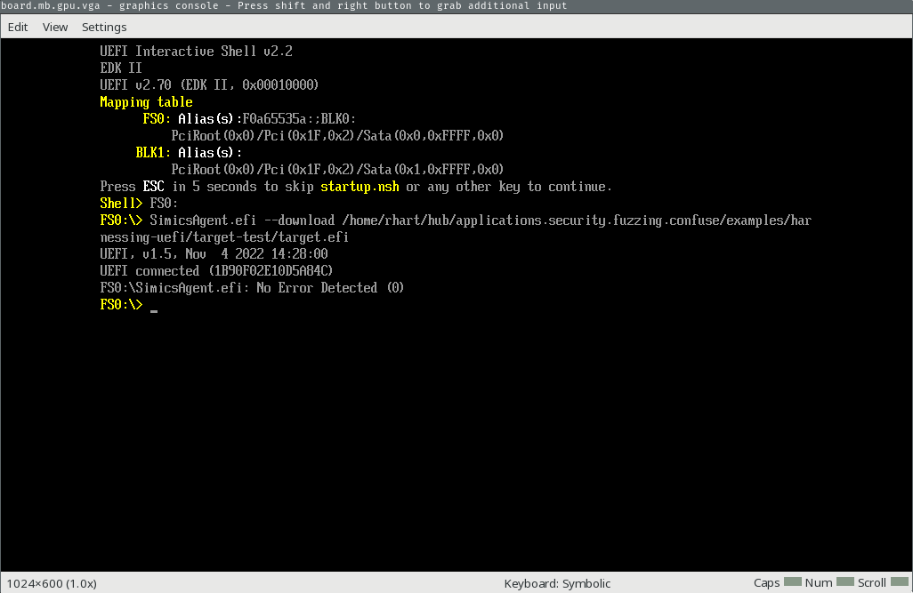
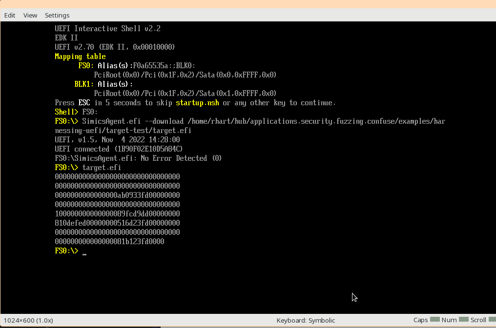

# Fuzzing a UEFI Target

In this tutorial, we will create the simplest possible UEFI app target for the fuzzer
and add a harness for it. We'll fuzz the harnessed application until we find a crash or
two, then we'll briefly show how to traige the crash we found.

- [Fuzzing a UEFI Target](#fuzzing-a-uefi-target)
  - [Set Up The Fuzzer](#set-up-the-fuzzer)
  - [Install Dependencies](#install-dependencies)
    - [Ubuntu](#ubuntu)
    - [Fedora](#fedora)
  - [Create the Target](#create-the-target)
    - [target.c](#targetc)
  - [Compile the Target](#compile-the-target)
  - [Test the Target](#test-the-target)
    - [Set Up the Project](#set-up-the-project)
    - [Run the Target](#run-the-target)
  - [Add the Harness](#add-the-harness)
  - [Understand the Harness](#understand-the-harness)
  - [Compile the Harnessed Target](#compile-the-harnessed-target)
  - [Modify the SIMICS Script](#modify-the-simics-script)
  - [Create an Input Corpus](#create-an-input-corpus)
  - [Fuzz the Harnessed Target](#fuzz-the-harnessed-target)
  - [Triage the Crash](#triage-the-crash)


## Set Up The Fuzzer

Before going through this tutorial, you'll need to have the fuzzer set up by following
the [setup guide](./Setup.md).

## Install Dependencies

For this tutorial, you need:

- `clang`
- `lld`

You can install both from your package manager.

### Ubuntu

To install `clang` and `lld` on Ubuntu:

```sh
apt-get -y install clang lld
```

### Fedora

To install `clang` and `lld` on Fedora:

```sh
dnf -y install clang lld
```

## Create the Target

Typically, UEFI app targets will be based on an existing UEFI framework, like EDK2. For
simplicity, we'll first cover harnessing using a much simpler target that we can compile
like any other software using `clang` and `lld`.

Our target will be as simple as possible -- it will print out in hex the contents of a
buffer. This is a poor target for fuzzing, but it will allow us to see our fuzzer in
action. We will write our target in one file to keep things simple.

### target.c

First, we need to define a few [EFI-specified](https://uefi.org/specifications)
structures. These structures define the system table, the header for the table, and the
protocol for the *EFI Simple Text Output Protocol*, which we will use to print text to
the screen. Don't worry too much about the contents of these structures, it isn't
relevant to harnessing. paste all the code below into `target.c`.

```c
#include <stdint.h>
#include <stddef.h>

// NOTE: Forward declaration
struct EfiSimpleTextOutputProtocol;

typedef uint64_t (*EfiTextString)(struct EfiSimpleTextOutputProtocol *this,
                                  int16_t *string);
typedef struct EfiTableHeader {
  uint64_t signature;
  uint32_t revision;
  uint32_t headerSize;
  uint32_t crc32;
  uint32_t reserved;
} EfiTableHeader;

typedef struct EfiSimpleTextOutputProtocol {
  uint64_t reset;
  EfiTextString output_string;
  uint64_t test_string;
  uint64_t query_mode;
  uint64_t set_mode;
  uint64_t set_attribute;
  uint64_t clear_screen;
  uint64_t set_cursor_position;
  uint64_t enable_cursor;
  uint64_t mode;
} EfiSimpleTextOutputProtocol;

typedef struct EfiSystemTable {
  EfiTableHeader hdr;
  int16_t *firmwareVendor;
  uint32_t firmwareRevision;
  void *consoleInHandle;
  uint64_t conIn;
  void *consoleOutHandle;
  EfiSimpleTextOutputProtocol *conOut;
  void *standardErrorHandle;
  uint64_t stdErr;
  uint64_t runtimeServices;
  uint64_t bootServices;
  uint64_t numberOfTableEntries;
  uint64_t configurationTable;
} EfiSystemTable;

```

We have now defined our spec-mandated structures, and we can move on to our application
code. This code declares a (probably stack) buffer, and prints out the buffer as hex
to the screen before returning. Notice that because UEFI mandates wide characters, our
buffer is of 16-bit integers.

```c

const char hex[] = {'0', '1', '2', '3', '4', '5', '6', '7',
                    '8', '9', 'a', 'b', 'c', 'd', 'e', 'f'};


int UefiMain(void *imageHandle, EfiSystemTable *SystemTable) {
  int16_t buffer[0x20];
  size_t size = sizeof(buffer) - 1;

  for (size_t i = 0; i < size; i++) {
    if (i != 0 && !(i % 8)) {
      SystemTable->conOut->output_string(SystemTable->conOut,
                                         (int16_t *)L"\r\n");
    }
    int16_t buf[5];
    buf[4] = 0;
    int16_t chr = buffer[i];
    buf[0] = hex[chr & 0xf];
    buf[1] = hex[(chr >> 4) & 0xf];
    buf[2] = hex[(chr >> 8) & 0xf];
    buf[3] = hex[(chr >> 12) & 0xf];

    SystemTable->conOut->output_string(SystemTable->conOut, (int16_t *)&buf[0]);
  }

  SystemTable->conOut->output_string(SystemTable->conOut, (int16_t *)L"\r\n");

  return 0;
}
```

This is all we need for our target!

## Compile the Target

To compile and link this target, run:

```sh
clang -target x86_64-pc-win32-coff -fno-stack-protector -fshort-wchar -mno-red-zone \
  -O0 -c target.c -o target.o
lld-link -filealign:16 -subsystem:efi_application -nodefaultlib -dll -entry:UefiMain \
  target.o -out:target.efi
```

Some of these arguments are probably unfamiliar, so we'll walk through each one:

- [`-target x86_64-pc-win32-coff`](https://clang.llvm.org/docs/CrossCompilation.html):
  output code for x86_64 architecture, for generic PCs (i.e. not Apple, NVidia, IBM),
  for the Win32 operating system, in COFF file format. UEFI is compatible with Win32
  in terms of object files and ABI, which is why we use this target and not one like
  "x86_64-pc-uefi" (which doesn't exist).
- [`-fno-stack-protector`](https://clang.llvm.org/docs/ClangCommandLineReference.html):
  Do not emit a stack protector
- [`-fshort-wchar`](https://clang.llvm.org/docs/ClangCommandLineReference.html):
  specifies that `wchar_t` is an unsigned short value.
- [`-mno-red-zone`](https://clang.llvm.org/docs/ClangCommandLineReference.html):
  Do not use a red-zone, which is an ABI-mandated 128-byte area beyond the stack pointer
  that is not modified by signal/interrupt handlers.
- [`-filealign:16`](https://lld.llvm.org/ELF/linker_script.html): 16-bit align the
  executable's sections.
- [`-subsystem:efi_application`](https://learn.microsoft.com/en-us/cpp/build/reference/subsystem-specify-subsystem?view=msvc-170):
  Specify linking for the EFI_APPLICATION subsystem.
- [`-nodefaultlib`](https://github.com/llvm/llvm-project/blob/bf98aaae00465c1e52376f8e138e4c51eb526d12/lld/COFF/Options.td#L82):
  Remove all default libraries from linker output (i.e. no glibc)
- [`-dll`](https://github.com/llvm/llvm-project/blob/bf98aaae00465c1e52376f8e138e4c51eb526d12/lld/COFF/Options.td#L139):
  Output a DLL (Dynamically Linked Library)
- [`-entry:UefiMain`](https://github.com/llvm/llvm-project/blob/bf98aaae00465c1e52376f8e138e4c51eb526d12/lld/COFF/Options.td#L47):
  Specify the name of the entrypoint symbol

You should have an output file, `target.efi`.

## Test the Target

Now that we have an EFI application, we should test it before we run it with the fuzzer.
In the following commands, replace `${SIMICS_HOME}` with the directory you installed
SIMICS into during setup. If you would like, you can run `export $(cat .env | xargs)` in
the root of this repository to export the variable(s) from the `.env` file you set up in
the setup instructions.

### Set Up the Project

Set up the project by creating a new SIMICS project as shown below (replace `6.0.169`
with your installed SIMICS version and `6.0.70` with your installed SIMICS QSP version):

```sh
${SIMICS_HOME}/simics-6.0.169/bin/project-setup ./target-test
cd ./target-test
echo "${SIMICS_HOME}/simics-qsp-x86-6.0.70/" > .package-list
./bin/project-setup
```

Now, copy the EFI application you just built into the project.

```sh
cp ../target.efi ./
```

Next, we need the boot drive `minimal_boot_disk.craff` from this repository, which we
will also copy into the project. Replace `PATH/TO/THIS/REPO/` with the path to this
repository's root.

```sh
cp /PATH/TO/THIS/REPO/examples/harnessing-uefi/rsrc/minimal_boot_disk.craff ./
```

Finally, we will add a SIMICS script that will automatically boot the machine, enter
the UEFI shell, and download our EFI application onto the machine for us.

```sh
cat <<EOF > test.simics
\$disk0_image = (lookup-file "%simics%/minimal_boot_disk.craff")
run-command-file "%simics%/targets/qsp-x86/qsp-hdd-boot.simics" 

script-branch "UEFI Shell Enter Branch" {
    local \$kbd = \$system.mb.sb.kbd
    local \$con = \$system.console.con
    local \$sercon = \$system.serconsole.con

    bp.time.wait-for seconds = 10

    \$kbd.key-press ESC
    bp.time.wait-for seconds = 3

    foreach \$i in (range 2) {
        \$kbd.key-press KP_DOWN
        bp.time.wait-for seconds = .5
    }

    \$kbd.key-press ENTER
    bp.time.wait-for seconds = .5

    \$kbd.key-press KP_UP
    bp.time.wait-for seconds = .5

    \$kbd.key-press ENTER
    bp.time.wait-for seconds = .5

    \$kbd.key-press ENTER         
    bp.time.wait-for seconds = .5

    \$con.input "FS0:\n"
    bp.time.wait-for seconds = 10

    # We are now in the UEFI shell, we'll download our EFI app
    local \$manager = (start-agent-manager)
    \$con.input ("SimicsAgent.efi --download " + (lookup-file "%simics%/target.efi") + "\n")
    bp.time.wait-for seconds = .5
}
run
EOF
```

### Run the Target

Now that we've set up our project, we can actually run the target. We will run SIMICS
with its GUI interface so we can interact with the machine directly. When we run our
fuzzer, we will typically not use the GUI for performance reasons, but it is helpful to
check that the fuzzer and target are working as expected.

```sh
./simics ./test.simics
```

The machine will boot up and automatically select several menu items to boot into the
UEFI shell and change to the `FS0` filesystem, then download our UEFI application.
You'll see the screen below:



Once booted to the UEFI shell, you can run the application by typing `target.efi` and
pressing enter on the graphical console:



You'll see uninitialized memory, because we did not zero the buffer after initializing
it. If you do, you are ready to move on to the next step by pressing `CTRL+C` in the
terminal you ran SIMICS in, then typing `exit` to exit SIMICS.

## Add the Harness

This fuzzer's "harness" uses SIMICS' *Magic Instruction* capabilities, which is a fancy
way of saying "run a `cpuid` instruction with a specific
[leaf value](https://www.felixcloutier.com/x86/cpuid)". Therefore, to harness source
code, all we need to do is issue a `cpuid` to tell the fuzzer where the beginning of the
fuzzing loop is, and another `cpuid` to tell the fuzzer where the end of the fuzzing
loop is in our code.

The harness we will cover first is the no-frills approach, invoking the SIMICS magic
instruction directly. In practice, we provide a [single header file](../include/tsffs.h)
you should use, which we'll cover [in another
document](./Harnessing.md#harnessing-with-provided-include-file). For the sake of
complete understanding, we will pull back the curtain first. After finishing this
tutorial, you should always prefer using the `tsffs.h` header file. You can check out
[target-harnessed-include.c](../examples/harnessing-uefi/src/target-harnessed-include.c)
to see how this target should be harnessed using the header.

We'll copy `target.c` to `target-harnessed.c` and modify our `UefiMain` function to look
like this:

```c
int UefiMain(void *imageHandle, EfiSystemTable *SystemTable) {
  uint32_t _a, _b, _c, _d = 0;

  int16_t buffer[0x20];
  size_t size = sizeof(buffer) - 1;
  int16_t *buffer_ptr = &buffer[0];

  __asm__ __volatile__(
      "cpuid\n\t"
      : "=a"(_a), "=b"(_b), "=c"(_c), "=d"(_d), "=S"(buffer_ptr), "=D"(size)
      : "0"((0x0001U << 16U) | 0x4711U), "S"(buffer_ptr), "D"(size));

  for (size_t i = 0; i < size; i++) {
    if (i != 0 && !(i % 8)) {
      SystemTable->conOut->output_string(SystemTable->conOut,
                                         (int16_t *)L"\r\n");
    }
    int16_t buf[5];
    buf[4] = 0;
    int16_t chr = buffer[i];
    buf[0] = hex[chr & 0xf];
    buf[1] = hex[(chr >> 4) & 0xf];
    buf[2] = hex[(chr >> 8) & 0xf];
    buf[3] = hex[(chr >> 12) & 0xf];

    SystemTable->conOut->output_string(SystemTable->conOut, (int16_t *)&buf[0]);
  }

  SystemTable->conOut->output_string(SystemTable->conOut, (int16_t *)L"\r\n");

  if (buffer[1] == 'a') {

  }

  __asm__ __volatile__("cpuid\n\t"
                       : "=a"(_a), "=b"(_b), "=c"(_c), "=d"(_d)
                       : "0"((0x0002U << 16U) | 0x4711U));

  return 0;
}
```

## Understand the Harness

Some of this might be unfamiliar, so we'll walk through each line we added.


The `cpuid` instruction stores the result in four 32-bit variables. We don't need to
read the *real* result from the `cpuid` instruction, but we should still put it
somewhere, so we save the result into these four values. We don't use them, so we name
them with underscores.
```c
uint32_t _a, _b, _c, _d = 0;
```

Here, we're just saving the address of the buffer in a pointer variable. `gcc` will let
us pass `&buffer[0]` directly into the inline assembly, but `clang` will not. We declare
a second variable as a more portable option.

```c
int16_t *buffer_ptr = &buffer[0];
```

If you aren't familiar with inline assembly, the `__asm__` blocks likely look very
arcane. The first line is our assembly instruction block (just our `cpuid` instruction
in this instance). The second line, with *constraints* like `=a` specifies where
*outputs* of the assembly should go. For example, `"=D"(size)` specifies that after this
assembly block (in this case, one instruction), the contents of register `rdi` should be
written to the variable `size`. The last line specifies our inputs, where `"0"`
specifies that this argument should be in the same position as the first output
argument, so in this cas in register `eax`, `"S"` specifies that the buffer address
should be in `rsi`, and so forth. If you're curious, you can read the
[docs](https://gcc.gnu.org/onlinedocs/gcc/Extended-Asm.html#x86-Operand-Modifiers).

```c
__asm__ __volatile__(
    "cpuid\n\t"
    : "=a"(_a), "=b"(_b), "=c"(_c), "=d"(_d), "=S"(buffer_ptr), "=D"(size)
    : "0"((0x0001U << 16U) | 0x4711U), "S"(buffer_ptr), "D"(size));
```

The block above translates to the assembly code:

```asm
0x180001025      mov   qword [var_48h], 0x3f
0x18000102e      lea   rax, [var_50h]
0x180001033      mov   qword [var_40h], rax
0x180001038      mov   rsi, qword [var_40h]
0x18000103d      mov   rdi, qword [var_48h]
0x180001042      mov   eax, 0x00014711
0x180001047      cpuid
0x180001049      mov   dword [var_9ch], eax
0x180001050      mov   dword [var_98h], ebx
0x180001057      mov   dword [var_94h], ecx
0x18000105e      mov   dword [var_90h], edx
0x180001065      mov   qword [var_40h], rsi
0x18000106a      mov   qword [var_48h], rdi
0x18000106f      mov   qword [var_38h], 0
```

We set `rsi` to the address of our buffer and `rdi` to the size of our buffer. Then,
we set `eax` to `0x00014711`. `0x0001` is the code the fuzzer recognizes indicating
this is a *start* harness (as opposed to a *stop* harness, or some other future type).
`0x4711` is the code SIMICS recognizes indicating this is a "magic" `cpuid`. Other
`cpuid` leaves will not trigger SIMICS' magic cpuid code.

Finally, the actual `cpuid` instruction happens, which SIMICS recognizes and passes the
correct information to the fuzzer, which does its own startup at this point.

Importantly for us, after this line the value of `size` will be modified to whatever
length the *current* fuzz input is (up to a maximum of the original `size` value), and
the contents of the buffer will be replaced with `size` bytes of fuzzer data. This
fuzzer data will be different each execution as the fuzzer tries different data to
achieve different feedback.

In real world usage, we define macros for this operation and provide them in a
header file to avoid exposing this complexity to the user, but it is important to
understand how this works under the hood in case you need to customize this process.

The final block below performs the same operation, but doesn't need any input or output
to or from the fuzzer because it simply signals the end of the fuzzing loop. When the
code reaches this point, the fuzzer will stop it and restore the snapshot at the start
with a new input. The only difference here is the magic value `0x2` instead of
`0x1` signifying a *stop* instead of a *start* harness.

```c
__asm__ __volatile__("cpuid\n\t"
                      : "=a"(_a), "=b"(_b), "=c"(_c), "=d"(_d)
                      : "0"((0x0002U << 16U) | 0x4711U));
```

Finally, you probably noticed we added the code below:

```c
  if (*(char *)buffer == 'a') {
    // Invalid opcode
    __asm__(".byte 0x06");
  } else if (*(char *)buffer == 'b') {
    // Crash
    uint8_t *bad_ptr = (uint8_t *)0xffffffffffffffff;
    *bad_ptr = 0;
  }
```

This does exactly what it says, when the first character in the fuzzer input is 'a', an
invalid instruction will be executed, triggering an *invalid opcode* exception (x86_64
exception #6). When the first character in the fuzzer input is 'b', the code will
dereference the address in `bad_ptr`, causing a crash! In our case, this will cause a
*page fault* (x86_64 exception code #14). You can find a list of supported faults linked
from the [API](./ModuleApi.md) page.

## Compile the Harnessed Target

Like before, we will compile our target:

```sh
clang -target x86_64-pc-win32-coff -fno-stack-protector -fshort-wchar -mno-red-zone \
  -O0 -c target-harnessed.c -o target-harnessed.o
lld-link -filealign:16 -subsystem:efi_application -nodefaultlib -dll -entry:UefiMain \
  target-harnessed.o -out:target-harnessed.efi
```

We end up with a `.efi` file containing our harnessed code.

## Modify the SIMICS Script

We need to make a couple small modifications to our SIMICS script. Create
a new script called `fuzz.simics`:

```sh
cat <<EOF > fuzz.simics
\$disk0_image = (lookup-file "%simics%/minimal_boot_disk.craff")
run-command-file "%simics%/targets/qsp-x86/qsp-hdd-boot.simics" 

script-branch "UEFI Shell Enter Branch" {
    local \$kbd = \$system.mb.sb.kbd
    local \$con = \$system.console.con
    local \$sercon = \$system.serconsole.con

    bp.time.wait-for seconds = 10

    \$kbd.key-press ESC
    bp.time.wait-for seconds = 3

    foreach \$i in (range 2) {
        \$kbd.key-press KP_DOWN
        bp.time.wait-for seconds = .5
    }

    \$kbd.key-press ENTER
    bp.time.wait-for seconds = .5

    \$kbd.key-press KP_UP
    bp.time.wait-for seconds = .5

    \$kbd.key-press ENTER
    bp.time.wait-for seconds = .5

    \$kbd.key-press ENTER         
    bp.time.wait-for seconds = .5

    \$con.input "FS0:\n"
    bp.time.wait-for seconds = 10

    # We are now in the UEFI shell, we'll download our EFI app
    local \$manager = (start-agent-manager)
    \$con.input ("SimicsAgent.efi --download " + (lookup-file "%simics%/target.efi") + "\n")
    bp.time.wait-for seconds = .5

    stop

    # Configure the fuzzer
    @conf.tsffs_module.iface.tsffs_module.init()
    @conf.tsffs_module.iface.tsffs_module.add_processor(SIM_get_object(simenv.system).mb.cpu0.core[0][0])
    # Page fault
    @conf.tsffs_module.iface.tsffs_module.add_fault(14)
    # Invalid opcode
    @conf.tsffs_module.iface.tsffs_module.add_fault(6)

    $con.input "target.efi\n"
    continue

}
run
EOF
```

The only change we make is at the bottom of our script branch. Because the fuzzer must
run unattended, we need to "type in" the name of the EFI application to run, so we use
`$con.input`. Before that, we need to stop execution and set up the fuzzer module that
is loaded into SIMICS. The fuzzer module's API is documented on the
[API page](./ModuleApi.md).

First, we call the `init` method. This tells the fuzzer to initialize itself at this
point and set up its internal state.

Next, we provide the processor object of the first (and in this case only, as this test
is single-threaded) processor we are running, which informs the module that it should be
traced and listened to for faults.

Finally, we inform the module that we want to treat exception #14 (page fault) as an
objective for this fuzzing campaign. The default is not to detect any exceptions as
objectives, so be sure to add a fault when you run the fuzzer.

You should customize the set of faults you set for your fuzzing task. For example, not
all applications will consider a page fault an error condition if they have paging
enabled, but may consider a double fault a serious issue indicating a problem with
the page fault handler.

## Create an Input Corpus

We'll create an input corpus with just one file in it. If we do not provide an input
corpus, a random corpus will be generated for us, but this is not the recommended way
to run the fuzzer.

```sh
mkdir -p input
echo "AAAAAAAAAAAAAAAAAAAAAAAAAAAAAAAA" > input/1
echo "BBBBBBBBBBBBBBBBBBBBBBBBBBBBBBBB" > input/2
echo "CCCCCCCCCCCCCCCCCCCCCCCCCCCCCCCC" > input/3
echo "DDDDDDDDDDDDDDDDDDDDDDDDDDDDDDDD" > input/4
```

This is obviously not an ideal corpus, but it

## Fuzz the Harnessed Target

If you aren't familiar with [`cargo`](https://doc.rust-lang.org/cargo/), it is the
Rust package manager and general utility tool for running and managing *crates*, which
is Rust's name for packages. We will use it to build and run our project.

The easiest way to run this fuzzer is by passing `--manifest-path` to `cargo run`. This
lets us run the fuzzer from anywhere, but avoids the need to install it in your `PATH`.

Your current directory should contain:

- `target-harnessed.efi`
- `fuzz.simics`

Before we run the fuzzer, let's take a look at its help output (replace
`/path/to/this/repository` with the actual path to this repo's root). Note that running
with the short `-h` flag will produce a shorter help message for quick reference
(replace `6.0.169` with your installed SIMICS base version).

```sh
cargo run --manifest-path /path/to/this/repository/Cargo.toml --release \
  --features=6.0.169 -- \
  --help
```

As you will see in the output (too long to paste here), the `simics-fuzz` frontend
provides easy shortcuts to set up a new project with the packages and files we need, so
to start the fuzzer all we need to do is run the command below (replace
`/path/to/this/repository` with the actual path to this repo's root, `6.0.169` with your
installed SIMICS base version, and `6.0.70` with your installed SIMICS QSP version).

```sh
cargo run --manifest-path /path/to/this/repository/Cargo.toml --release \
  --features=6.0.169 -- \
  --project ./project --input ./input --solutions ./solutions --corpus ./corpus \
  --log-level INFO --trace-mode once --executor-timeout 60 --timeout 3 --cores 1 \
  --package 2096:6.0.70 \
  --file "./target-harnessed.efi:%simics%/target.efi" \
  --file "./fuzz.simics:%simics%/fuzz.simics" \
  --file "/path/to/this/repository/examples/harnessing-uefi/rsrc/minimal_boot_disk.craff:%simics%/minimal_boot_disk.craff" \
  --command 'COMMAND:run-script "%simics%/fuzz.simics"'
```

The target software will start up and begin fuzzing. There is a fair amount of output,
but the key messages to keep an eye on are messages showing that processors are
correctly added for the module, detector, and tracer components:

```text
  2023-07-20T22:45:26.689753Z  INFO tsffs_module::module::components::detector: Detector added processor #0
    at tsffs_module/src/module/components/detector/mod.rs:162

  2023-07-20T22:45:26.689765Z  INFO tsffs_module::module::components::tracer: Tracer added processor #0
    at tsffs_module/src/module/components/tracer/mod.rs:123

  2023-07-20T22:45:26.689772Z  INFO tsffs_module::module: Added processor #0
    at tsffs_module/src/module/mod.rs:362
```

As well as the message showing which faults have been added:

```text
  2023-07-20T22:45:26.689868Z  INFO tsffs_module::module::components::detector: Detector adding fault X86_64(Page)
    at tsffs_module/src/module/components/detector/mod.rs:173

  2023-07-20T22:45:26.689958Z  INFO tsffs_module::module::components::detector: Detector adding fault X86_64(InvalidOpcode)
    at tsffs_module/src/module/components/detector/mod.rs:173
```

The fuzzer will display an informational message every 15 seconds approximately (sooner
if an event occurs) that looks like this:

```text
  2023-07-20T22:45:30.044546Z  INFO simics_fuzz::fuzzer: [Testcase    #1]  (GLOBAL) run time: 0h-0m-15s, clients: 2, corpus: 3, objectives: 0, executions: 5, exec/sec: 3.250
    at simics-fuzz/src/fuzzer/mod.rs:565 on main ThreadId(1)

  2023-07-20T22:45:30.044577Z  INFO simics_fuzz::fuzzer:                   (CLIENT) corpus: 3, objectives: 0, executions: 5, exec/sec: 3.250, coverage: 583/131072 (0%)
    at simics-fuzz/src/fuzzer/mod.rs:565 on main ThreadId(1)
```

This message displays executions, speed, coverage, corpus size, and objectives found.
After a minute or so, you should see the messages indicating that first, an exception
was seen (and it was a registered exception with `add_fault`) and second, a new
objective was picked up by the fuzzer.

```text
2023-07-20T22:45:51.695252Z  INFO tsffs_module::module::components::detector: Got exception with fault: X86_64(InvalidOpcode)
    at tsffs_module/src/module/components/detector/mod.rs:223

  2023-07-20T22:45:51.695301Z  INFO tsffs_module::module::components::detector: Got exception with fault: X86_64(InvalidOpcode)
    at tsffs_module/src/module/components/detector/mod.rs:223

  2023-07-20T22:45:51.695567Z  INFO simics_fuzz::fuzzer: Target crashed with fault X86_64(InvalidOpcode)
    at simics-fuzz/src/fuzzer/mod.rs:439 on main ThreadId(1)

  2023-07-20T22:45:51.702212Z  INFO simics_fuzz::fuzzer: [Objective   #1]  (GLOBAL) run time: 0h-0m-37s, clients: 2, corpus: 5, objectives: 1, executions: 52, exec/sec: 2.242
    at simics-fuzz/src/fuzzer/mod.rs:565 on main ThreadId(1)
```

This will be accompanied by a new solution file in our solutions directory:


```sh
$ cat solutions/*
aCCCCCCCC%
```

And indeed, our found solution does have 'a' as the first character (which corresponds
with the invalid opcode crash we have). If we let the fuzzer continue, we will find
another solution that triggers the second crash.

## Triage the Crash

Now that we have some crashes in our `solutions` directory, we can triage the crash
using SIMICS' excellent debugging capabilities. To drop into the SIMICS command line
interface, at the point of the crash, add an argument `--repro solutions/SOLUTION_FILE`
to your command (replace `/path/to/this/repository` with the actual path to this repo's
root, `6.0.169` with your installed SIMICS base version, and `6.0.70` with your
installed SIMICS QSP version).

```sh
cargo run --manifest-path /path/to/this/repository/Cargo.toml --release \
  --features=6.0.169 -- \
  --project ./project --input ./input --solutions ./solutions --corpus ./corpus \
  --log-level INFO --trace-mode once --executor-timeout 60 --timeout 3 --cores 1 \
  --package 2096:6.0.69 \
  --file "./target-harnessed.efi:%simics%/target-harnessed.efi" \
  --file "./fuzz.simics:%simics%/fuzz.simics" \
  --file "/path/to/this/repository/examples/harnessing-uefi/rsrc/minimal_boot_disk.craff:%simics%/minimal_boot_disk.craff" \
  --command 'COMMAND:run-script "%simics%/fuzz.simics"' \
  --repro solutions/SOLUTION_FILE
```

The fuzzer will run with the single provided input until the fault, timeout, or SIMICS
error the fuzzer caught previously when running with this input occurs. Then, the fuzzer
will drop you into the standard SIMICS command line interface.

```simics
  2023-07-21T20:14:52.840971Z  INFO tsffs_module::module::components::detector: Got exception with fault: X86_64(InvalidOpcode)
    at tsffs_module/src/module/components/detector/mod.rs:225

  2023-07-21T20:14:52.841090Z  INFO tsffs_module::module: Entering repro mode, starting SIMICS CLI
    at tsffs_module/src/module/mod.rs:214

simics>
```

From this point, you can use SIMICS as you normally would to debug the crash state. For
example, you can view the state of registers at the crash:

```simics
simics> pregs
64-bit mode
Pending exception, vector 6
rax = 0x0000000000000061             r8  = 0x0000000000000000
rcx = 0x0000000000000000             r9  = 0x0000000000000260
rdx = 0x0000000000000012             r10 = 0x00000000f016d1c0
rbx = 0x00000000df321b18             r11 = 0x0000000000000020
rsp = 0x00000000df3218d0             r12 = 0x0000000000000000
rbp = 0x00000000df321b08             r13 = 0x00000000dda2b918
rsi = 0x00000000df321920             r14 = 0x00000000dd7d2cd0
rdi = 0x0000000000000009             r15 = 0x00000000dd838bc8

rip = 0x00000001800011c0

eflags = 0 0 0 0 0 0 0 0 0 0 0 0 1 0 0 1 0 0 0 1 1 0 = 0x00000246
         I V V A V R - N I I O D I T S Z - A - P - C
         D I I C M F   T O O F F F F F F   F   F   F
           P F           P P                        
                         L L                        
```

Since this is exception #6, invalid opcode, we might want to examine memory at the
instruction pointer to determine why we are executing an invalid instruction:

```simics
simics> x %rip
ds:0x00000001800011c0  06e9 2700 0000 0fbe 4424 5083 f862 0f85  ..'.....D$P..b..
```

If we were really debugging, we would have found the problem: `0x06` isn't a valid
x86_64 instruction!

One key option that is available in addition to normal SIMICS commands is reverse
execution and restoring to the initial snapshot (which was taken for you by the fuzzer).
The bookmark created by the fuzzer just after writing the testcase into memory is called
`start`.

```simics
simics> list-bookmarks
 name                                     cycles
------------------------------------------------------
 start                              75187942584
 <current execution point>          75188460742
------------------------------------------------------
```

We can restore the bookmark by running:

```simics
simics> reverse-to start
[board.mb.cpu0.core[0][0]]  cs:0x0000000180001047 p:0x180001047  cpuid
```

From this point, we can continue to view registers, step instructions forward, modify
memory, step *backward* (because we have reverse execution enabled), etc. You
can find complete documentation for SIMICS including all of its powerful debugging tools
in the documentation by running `./documentation` in the SIMICS project we created in
`./project`.
