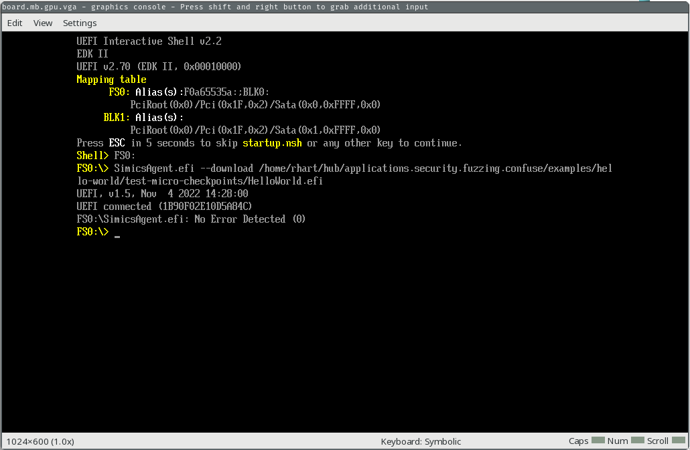
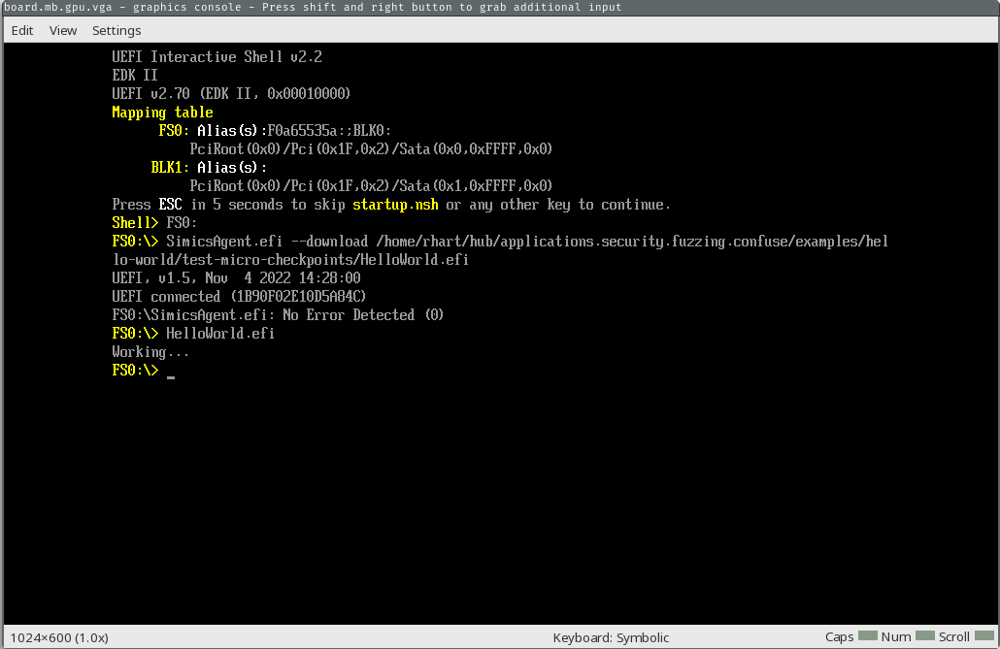
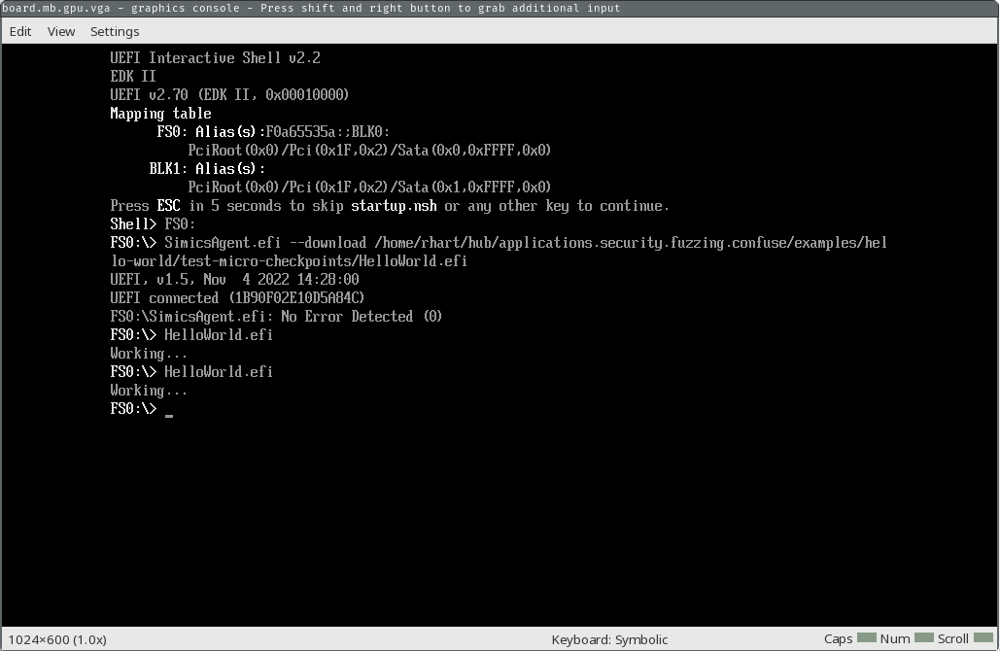

# Compatibility

There are a small number of requirements for the target software for this fuzzer to
support it as a fuzz target. If your project meets the requirements here, it is likely
it can use this fuzzer for fuzz testing!

- [Compatibility](#compatibility)
  - [Requirements Overview](#requirements-overview)
  - [Architecture](#architecture)
  - [Micro Checkpoints](#micro-checkpoints)
    - [Testing Micro Checkpoints](#testing-micro-checkpoints)
      - [Set Up The Project](#set-up-the-project)
      - [Test Micro Checkpoints](#test-micro-checkpoints)
      - [Testing for Your App](#testing-for-your-app)
  - [Snapshots](#snapshots)

## Requirements Overview

TSFFS has two requirements to run:

* Your target software must be running on a CPU model with a supported architecture
* Your target CPU model must support either micro-checkpoints or snapshots

## Architecture

Supported Architectures:

- x86_64
- x86
- RISC-V (32 and 64-bit)

If your model's target architecture is one of these, it is supported by TSFFS. If not,
file an issue or pull request. Adding new architectures is easy, and can be a good
first contribution to the fuzzer. See the generic and specific architecture information
[here](https://github.com/intel/tsffs/tree/main/src/arch).

## Micro Checkpoints

Micro checkpoints are only supported prior to Simics 7.0.0. If you are using a newer
version of Simics, [snapshots](#snapshots) first.

SIMICS has a feature called *micro checkpoints* that allows in-memory snapshots of the
target software state, as well as reasonably fast restoration of these snapshots to
enable fuzzing.

There are different levels of micro checkpoint support -- this fuzzer requires only that
initialization and code actively under test with the fuzz harness for your project works
correctly with micro checkpoints. You can test that micro checkpoints work for your
model with a simple test.

### Testing Micro Checkpoints

As an example, let's consider the x86 QSP platform model that ships with SIMICS and the
Hello World EFI [resource
example](https://github.com/intel/tsffs/tree/main/tests/rsrc/x86_64-uefi) which you can
build by running `./build.sh` in the resource directory. The process for fuzzing this
target software follows the basic flow:

1. Boot the x86 QSP BIOS with the QSP x86 hdd boot script, with a minimal boot disk
2. Upload the test.efi EFI app using the SIMICS agent (for most real targets, we
   would just boot an image that has our target software EFI app already included).
3. Run the test.efi EFI app we uploaded
4. While running, the test.efi target software code reaches our start harness,
   which triggers the beginning of the fuzzing loop by taking a micro checkpoint. The
   fuzzer continues execution of the target software.
5. While running, either a fault is encountered or the software reaches the stop
   harness. In either case, the fuzzer restores the original micro checkpoint with a
   new fuzz input, runs the software, and replays this step infinitely.

#### Set Up The Project

In this case, to test micro checkpoints manually from the SIMICS command line, we can
create a new project (replace `6.0.169` with your installed SIMICS base version):

```sh
$ "${SIMICS_HOME}/simics-6.0.169/bin/project-setup" ./test-micro-checkpoints
Project created successfully
$ cd test-micro-checkpoints
```

This Hello World example project needs the `2096` package, which is for the SIMICS QSP
platform model.  Add the package to the project by running (replace `6.0.70` with your
installed SIMICS QSP package version):

```sh
$ echo "${SIMICS_HOME}/simics-qsp-x86-6.0.70/" >> ".package-list"
$ ./bin/project-setup
Project updated successfully
```

We will also add a simics script. Add the contents below as `test.simics` in the project
root.

```simics
$disk0_image = (lookup-file "%simics%/minimal_boot_disk.craff")
run-command-file "%simics%/targets/qsp-x86/qsp-hdd-boot.simics" 

script-branch "UEFI Shell Enter Branch" {
    local $kbd = $system.mb.sb.kbd
    local $con = $system.console.con
    local $sercon = $system.serconsole.con

    bp.time.wait-for seconds = 10

    $kbd.key-press ESC
    bp.time.wait-for seconds = 3
    foreach $i in (range 2) {
        $kbd.key-press KP_DOWN
        bp.time.wait-for seconds = .5
    }
    $kbd.key-press ENTER
    bp.time.wait-for seconds = .5
    $kbd.key-press KP_UP
    bp.time.wait-for seconds = .5
    $kbd.key-press ENTER
    bp.time.wait-for seconds = .5
    $kbd.key-press ENTER         
    bp.time.wait-for seconds = .5
    $con.input "FS0:\n"
    bp.time.wait-for seconds = 10

    # We are now in the UEFI shell, we'll download our EFI app
    local $manager = (start-agent-manager)
    $con.input ("SimicsAgent.efi --download " + (lookup-file "%simics%/test.efi") + "\n")
    bp.time.wait-for seconds = .5
}
```

Finally, build and copy the `test.efi` module and the `minimal_boot_disk.craff` image
into the project root:

```sh
pushd /path/to/this/repo/examples/tests/x86_64-uefi/
ninja
popd
cp /path/to/this/repo/examples/tests/x86_64-uefi/test.efi ./
cp /path/to/this/repo/examples/rsrc/minimal_boot_disk.craff ./
```

#### Test Micro Checkpoints

To test micro checkpoints, run SIMICS in the project with the script you just created:

```sh
$ ./simics test.simics
Intel Simics 6 (build 6218 linux64) © 2024 Intel Corporation

Use of this software is subject to appropriate license.
Type 'copyright' for details on copyright and 'help' for on-line documentation.

[board.mb.cpu0.core[0][0] info] VMP disabled. Failed to open device.

WARNING: Simics failed to enable VMP. Enabling VMP substantially improves
         simulation performance. The problem is most likely caused by the
         vmxmon kernel module not being properly installed or updated.
         See the "Simics User's Guide", the "Performance" section,
         for instructions how to setup VMP.

NAPT enabled with gateway 10.10.0.1/24 on link ethernet_switch0.link.
NAPT enabled with gateway fe80::2220:20ff:fe20:2000/64 on link ethernet_switch0.link.
simics>
```

SIMICS is now running, and we can continue through the boot process all the way into
the EFI shell on filesystem FS0 by running `run`:

```simics
simics> run
[board.mb.sb.lpc.bank.cs_conf unimpl] Write to unimplemented field cs_conf.oic.aen (0x31ff) (value written = 0x01, contents = 0x00), will not warn again.
[board.mb.cpu0.core[0][0] unimpl] Writing to unimplemented MSR 0x1f2 (ia32_smrr_physbase), value = 0xdf800006
[board.mb.cpu0.core[0][0] unimpl] Writing to unimplemented MSR 0x1f3 (ia32_smrr_physmask), value = 0xff800000
[board.mb.sb.lpc.bank.acpi_io_regs unimpl] Write to unimplemented field acpi_io_regs.smi_en.EOS (0x30) (value written = 0x00000001, contents = 0x00000000), will not warn again.
[board.mb.cpu0.core[0][0] unimpl] Reading from unimplemented MSR 0x1f3 (ia32_smrr_physmask), value = 0xff800000
[board.mb.cpu0.core[0][0] unimpl] Writing to unimplemented MSR 0x1f3 (ia32_smrr_physmask), value = 0xff800800
[board.mb.sb.spi.bank.spi_regs spec-viol] Write to read-only field spi_regs.hsfsts.fdv (value written = 0x0000, contents = 0x0001).
[board.mb.sb.thermal.bank.pci_config spec-viol] Enabling bus master, but this device doesn't support it
[board.mb.sb.lan.bank.csr unimpl] Read from unimplemented register csr.extcnf_ctrl (0x00000f00) (contents = 0x00000000).
[board.mb.sb.lan.bank.csr unimpl] Write to unimplemented register csr.extcnf_ctrl (0xf00) (value written = 0x00000020).
[board.mb.sb.lan.bank.csr unimpl] Write to unimplemented field csr.tctl.rrthresh (0x400) (value written = 0x00000000, contents = 0x00000001), will not warn again.
[board.mb.sb.lan.bank.csr unimpl] Read from unimplemented register csr.fwsm_s (0x00005b54) (contents = 0x00000000).
[board.mb.sb.lan.bank.csr unimpl] Write to unimplemented register csr.strap (0xc) (value written = 0x00008086).
[board.mb.sb.lan.bank.csr spec-viol] Read from poorly or non-documented register csr.dummy_3004 (contents = 0).
[board.mb.sb.lan.bank.csr spec-viol] Write to poorly or non-documented register csr.dummy_3004 (value written = 0x50000, contents = 0).
[board.mb.sb.phy.bank.mii_regs unimpl] Write to unimplemented register mii_regs.vendor_specific[15] (0x3e) (value written = 0x6094).
[board.mb.sb.phy.bank.mii_regs unimpl] Read from unimplemented register mii_regs.vendor_specific[4] (0x0028) (contents = 0x0000).
[board.mb.sb.phy.bank.mii_regs unimpl] Write to unimplemented register mii_regs.vendor_specific[4] (0x28) (value written = 0x0000).
[board.mb.sb.lan.bank.csr spec-viol] writing 0 to count is not allowed
[board.mb.sb.lan.bank.csr spec-viol] writing 0 to count is not allowed
[board.mb.sb.lan.bank.csr unimpl] Read from unimplemented register csr.eec (0x00000010) (contents = 0x00000000).
[board.mb.sb.lan.bank.csr unimpl] Read from unimplemented register csr.ledctl (0x00000e00) (contents = 0x00000000).
[board.mb.sb.lan.bank.csr unimpl] Write to unimplemented field csr.tx_queue[0].txdctl.pthresh (0x3828) (value written = 0x0000001f, contents = 0x00000000), will not warn again.
[board.mb.sb.lan.bank.csr unimpl] Write to unimplemented field csr.tx_queue[0].txdctl.wthresh (0x3828) (value written = 0x00000001, contents = 0x00000000), will not warn again.
[board.mb.sb.lan.bank.csr unimpl] Write to unimplemented field csr.tx_queue[0].txdctl.gran (0x3828) (value written = 0x00000001, contents = 0x00000000), will not warn again.
[board.mb.sb.lan.bank.csr unimpl] Write to unimplemented field csr.tx_queue[1].txdctl.pthresh (0x3928) (value written = 0x0000001f, contents = 0x00000000), will not warn again.
[board.mb.sb.lan.bank.csr unimpl] Write to unimplemented field csr.tx_queue[1].txdctl.wthresh (0x3928) (value written = 0x00000001, contents = 0x00000000), will not warn again.
[board.mb.sb.lan.bank.csr unimpl] Write to unimplemented field csr.tx_queue[1].txdctl.gran (0x3928) (value written = 0x00000001, contents = 0x00000000), will not warn again.
[board.mb.sb.lan.bank.csr spec-viol] Read from poorly or non-documented register csr.dummy_5b00 (contents = 0).
[board.mb.sb.lan.bank.csr spec-viol] Write to poorly or non-documented register csr.dummy_5b00 (value written = 0xffffffc0, contents = 0).
[board.mb.sb.lan.bank.csr spec-viol] Read from poorly or non-documented register csr.sec (contents = 0).
[board.mb.sb.lan.bank.csr spec-viol] writing 0 to count is not allowed
[board.mb.sb.lan.bank.csr spec-viol] writing 0 to count is not allowed
[board.mb.sb.lan spec-viol] access to reserved register at offset 0x280c in CSR bank
[board.mb.sb.lan.bank.csr unimpl] Write to unimplemented register csr.h2me (0x5b50) (value written = 0x00000000).
[board.mb.sb.phy.bank.mii_regs unimpl] Read from unimplemented register mii_regs.vendor_specific[3] (0x0026) (contents = 0x0000).
[board.mb.sb.lan.bank.csr unimpl] Write to unimplemented field csr.ctrl.rfce (0) (value written = 0x00000001, contents = 0x00000000), will not warn again.
[board.mb.sb.lan.bank.csr unimpl] Write to unimplemented field csr.ctrl.tfce (0) (value written = 0x00000001, contents = 0x00000000), will not warn again.
[matic0 info] The Simics agent has terminated.
[matic0 info] disconnected from UEFI0 (0x1b90f02e10d5a84c)
running>
```

You'll see several automatic actions on the SIMICS GUI, and you will end up with the
console screen below.



First, we'll run our EFI app to make sure all is well.

```simics
running> $system.console.con.input "test.efi\n"
```

You should see "Working..." print out on the console.



Now, we'll go ahead stop the simulation and take our micro checkpoint.

```simics
running> stop
simics> @VT_save_micro_checkpoint("origin", 0)
None
```

Our simulation is now stopped, with a checkpoint just taken. We'll run the EFI app
again and continue, then stop the simulation after the app finishes running.

```simics
simics> $system.console.con.input "test.efi\n"
simics> continue
running> stop
```

We stopped our execution after the app executed, so you should see the output from the
second time we ran it ("Working...") printed on the GUI console.



Now, we will restore our micro checkpoint and clear the recorder. The second step is
important, because if we did not clear the recorder we would *replay* the execution of
the app.

```simics
simics> @VT_restore_micro_checkpoint(0)
None
simics> @CORE_discard_future()
None
simics> continue
```

The console should be back to the state it was before you ran the second app execution,
and will look like this:


#### Testing for Your App

What you want to fuzz will depend on your project, so this procedure will change
somewhat depending on your project. In general, try to follow this flow:

1. Save a micro checkpoint
2. Run whatever software you want to fuzz in a normal configuration, for example via
   a test case you already have
3. Restore the micro checkpoint
4. Make sure everything is reset as you expect it to be, for example if your software
   relies on register values or filesystem objects, make sure they are reset.
5. If you are able, do this several times. Some issues can occur on many executions that
   are not apparent after just one, for example if your model has a memory leak. You can
   script this step if you'd like.


## Snapshots

Newer versions of SIMICS (>= 7.0.0) support a new feature called snapshots, which are
similar to micro checkpoints but do not rely on underlying rev-exec support. If your
model supports a new version of SIMICS, follow the same instructions as for micro
checkpoints, but replace:

* `VT_save_micro_checkpoint("origin", 0)` with `VT_save_snapshot("origin")`
* `VT_restore_micro_checkpoint(0)` with `VT_restore_snapshot("origin")`

And do not call `CORE_discard_future`.