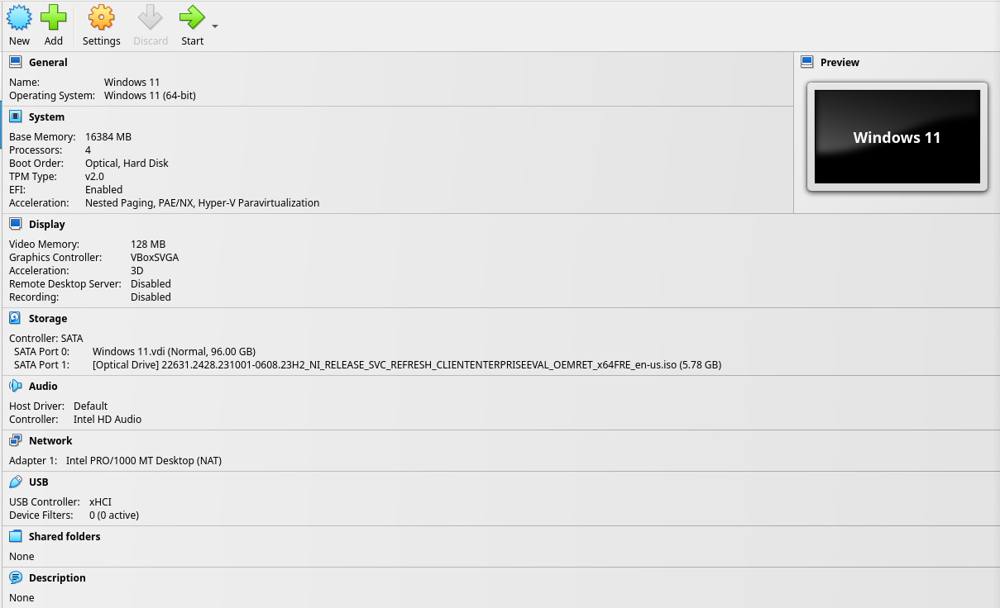
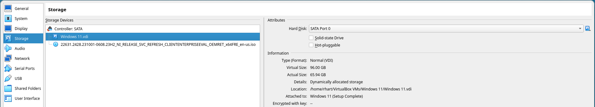

# Convert Image to CRAFF

Now that we have set up our Windows image, we need to convert the image to the
CRAFF format that Simics uses.

First, shut down the guest machine with:

```powershell
shutdown /s /f /t 0
```

## Find The Virtual Disk Image

After the guest machine has shut down, click the "Storage" category header in
the machine page shown below.



The settings window for Storage will appear. Note the "Location" field. This is
the path to the virtual disk image.



## Convert the Virtual Disk Image

To convert the VDI to raw, we can use either the VirtualBox CLI:

```sh
VBoxManage clonehd "/path/to/VirtualBox VMs/Windows 11/Windows 11.vdi" "examples/tutorials/windows-kernel/windows-11.img" --format raw
```

Or we can use the qemu-img tool (included with QEMU installations):

```sh
qemu-img convert -f vdi -O vdi "/path/to/VirtualBox VMs/Windows 11/Windows 11.vdi" "examples/tutorials/windows-kernel/windows-11.img"
```

Then, we will use the `craff` utility included with Simics. Find your Simics
base directory (e.g. `simics-6.0.185`), and run:

```sh
~/simics/simics-6.0.185/bin/craff -o examples/tutorials/windows-kernel/windows-11.craff examples/tutorials/windows-kernel/windows-11.img
```
