# Create a VM

Run VirtualBox. You will be greeted with this window (if this is your first
time using VirtualBox, the list of VMs will be empty, for example below you
will not see an entry for "Windows 10"):

Click "New" to create a new Virtual Machine. You should see the dialog below.

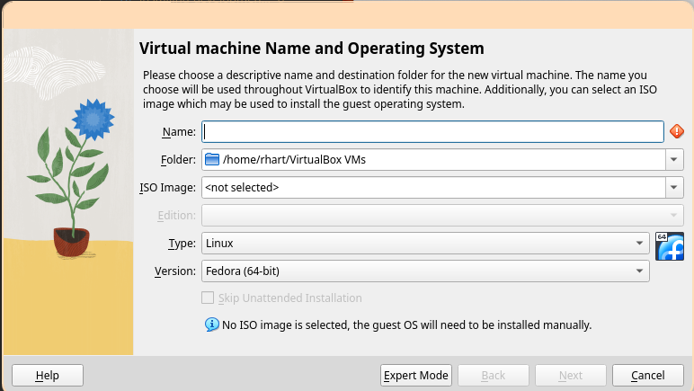

Enter a name, select the ISO image we downloaded, and be sure to check "Skip
unattended installation". Then, click "Next".

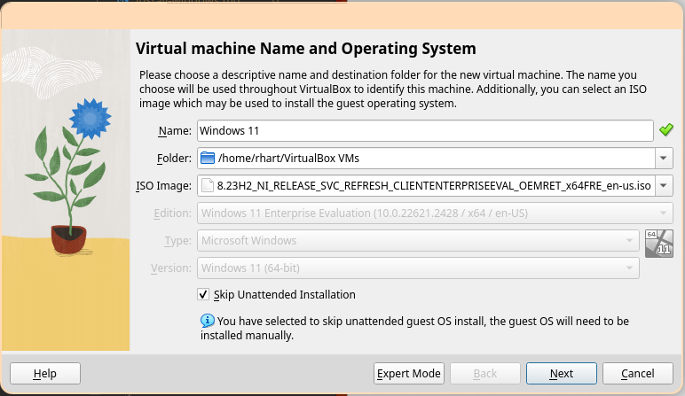

At least 4GB of RAM and 1 CPU is recommended, but add more if you have
resources available. Be sure to *check* "Enable EFI (special OSes Only)". Then,
click "Next".

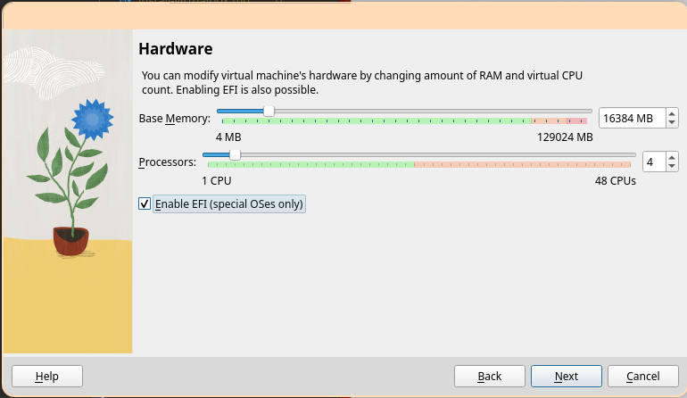

At least 64GB of disk space is recommended to ensure enough space for all
required development tools, including Visual Studio and the Windows Driver Kit.

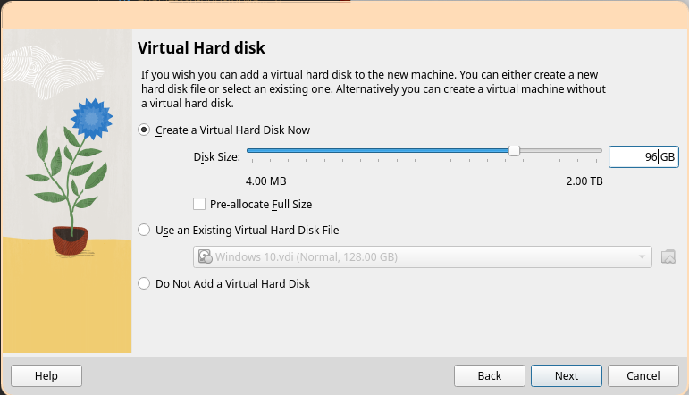

Ensure the settings look correct, then select "Finish".

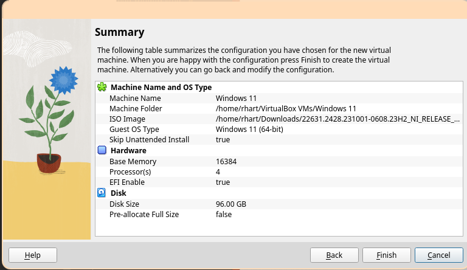

Click "Settings" in the Windows 11 image tab.

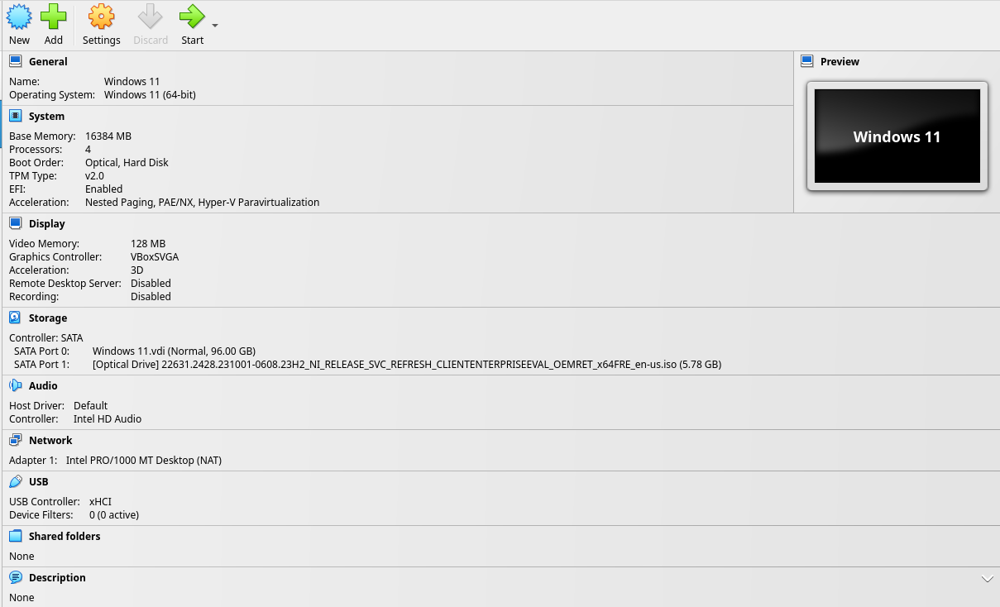

In the "System" tab and "Motherboard" sub-tab, ensure the following settings.
Uncheck "Floppy" from "Boot Order", ensure "TPM" is set to "v2.0", ensure
"Enable I/O APIC" and "Enable EFI" are checked, and ensure "Enable Secure Boot"
is *unchecked*.

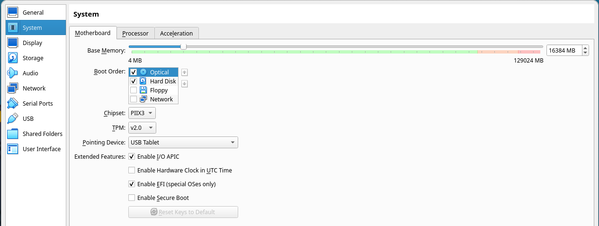

In the "System" tab and "Processor" sub-tab, ensure the following settings.
Ensure "Enable PAE/NX" is *checked* and that "Enable Nested VT-x/AMD-V" is
*unchecked*.

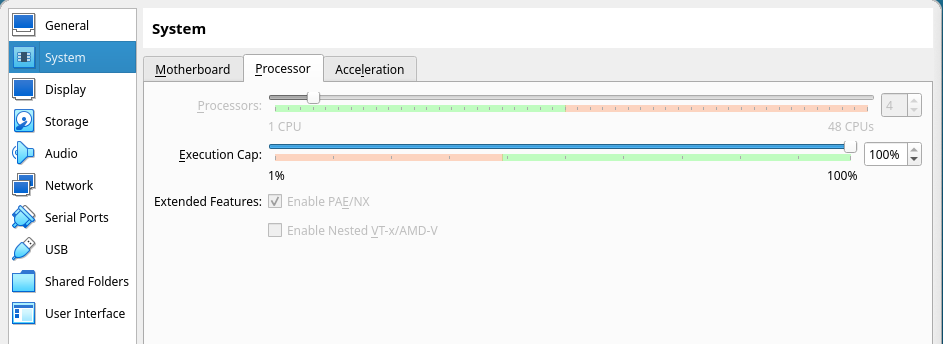

In the "Display" tab, ensure "Graphics Controller" is set to "VBoxSVGA" and
"Extended Features: Enable 3D Acceleration" is *checked*.

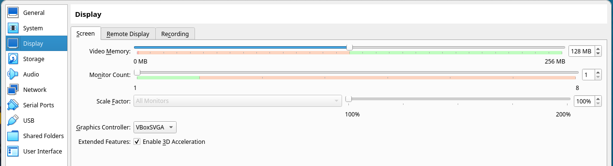

Click "OK" to close the settings Window, then click "Start" in the Windows 11
image tab to start the virtual machine.

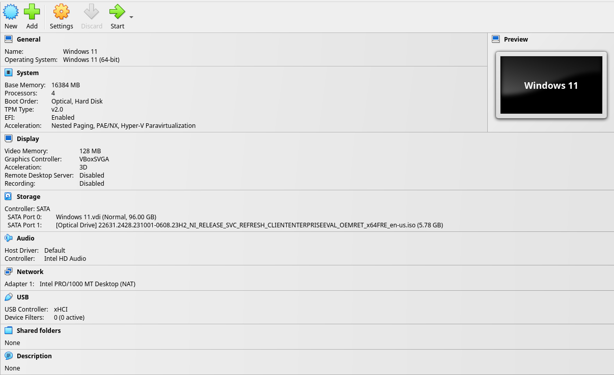

A window that says "Press any key to boot from CD or DVD....." will appear.
Click inside the Virtual Machine window and press "Enter". The VirtualBox EFI
boot screen should appear, followed by the Windows Setup dialog. We're ready to
install Windows.

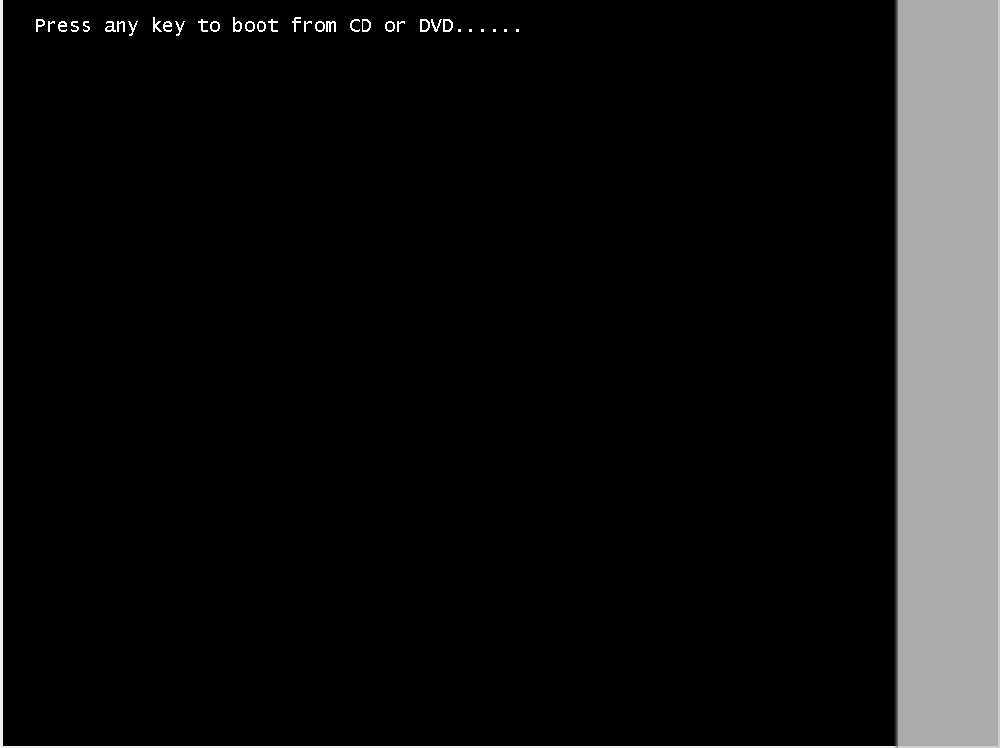
