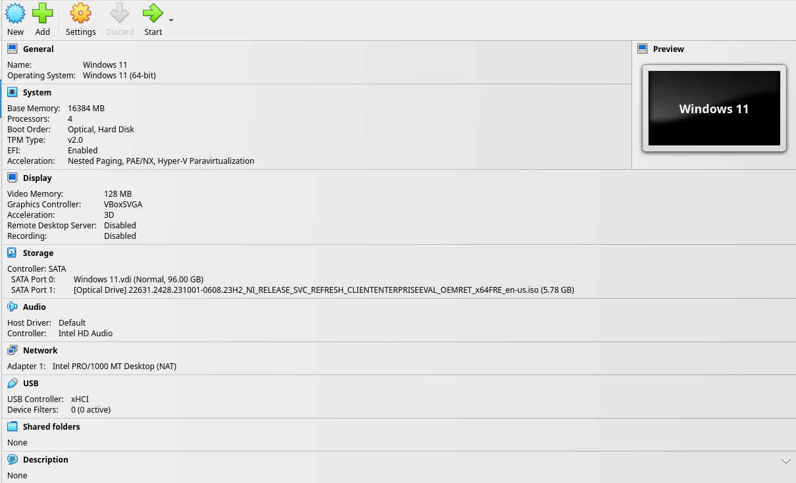

# Enable SSH Port Forwarding in VirtualBox

Shut down the VM by selecting `File` > `Close` in the
VirtualBox menu bar, then select "Send the shutdown
signal".


Click "Settings" in the Windows 11 image tab.




Select the "Network" tab on the left.


Select the "Advanced" drop-down menu.


Select the "Port Forwarding" button to open the port forwarding menu.


Select the top-right button "Adds port forwarding rule" to add a new rule.


Set the name to "OpenSSH" on protocol TCP from host
port 2222 to guest port 22. Leave both IP fields blank.
Select "OK" in the port forwarding menu, then select
"OK" on the settings menu.


Start the image back up by clicking "Start" in the
Windows 11 image tab.

Then, on your host (if your host is a Windows machine,
enable the `OpenSSH.CLIENT` capability on your host as
shown above), run:

```sh
ssh -p 2222 user@localhost
```

After entering the password at the prompt, you should
be greeted with a command prompt:

```txt
Microsoft Windows [Version 10.0.22631.2428]
(c) Microsoft Corporation. All rights reserved.

user@DESKTOP-QNP1C9S C:\Users\user>
```
