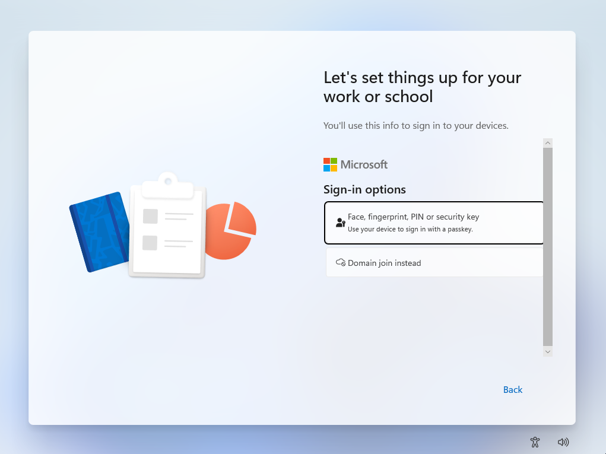

# Install Windows

Change the language options if desired, but note the tutorial
will assume English.

Select "Install Now".

Accept the license terms and select "Next".

Select "Custom: Install Windows only (advanced)".

Select "New".

Select "Apply". The default size is the full size of the virtual drive.

Select "OK".

Select "Next".

Wait for the installation process to complete. The machine will reboot a couple times.
If prompted to press a key to boot from CD or DVD, do not press anything, because we do
not want to do that.

Select your region.

Select your keyboard layout.

Skip adding a second keyboard layout unless you need one.

Select "Sign-in Options".

Select "Domain join instead".

Set a username. For this tutorial, we'll use `user`. Select "Next".

Set a password. For this tutorial, we'll use `password`. Select "Next".

Confirm your password. Select "Next".

Our first dog's name was `password`. Select "Next".

Surprisingly, we were also born in the city of `password`. Select "Next".

This cannot possibly be a coincidence! Our childhood nickname was also `password`.
Select "Next".

Disable some of Microsoft's snooping by checking "No" for all options. Then select "Accept".

Eventually, you'll be greeted with a clean desktop.

