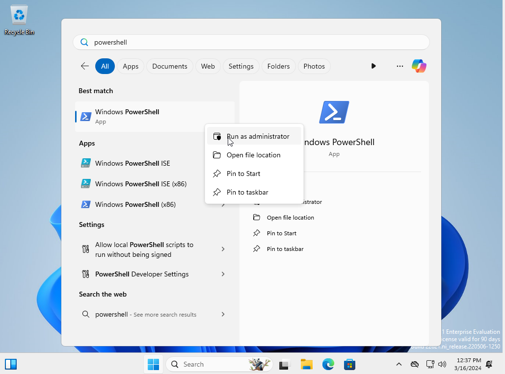
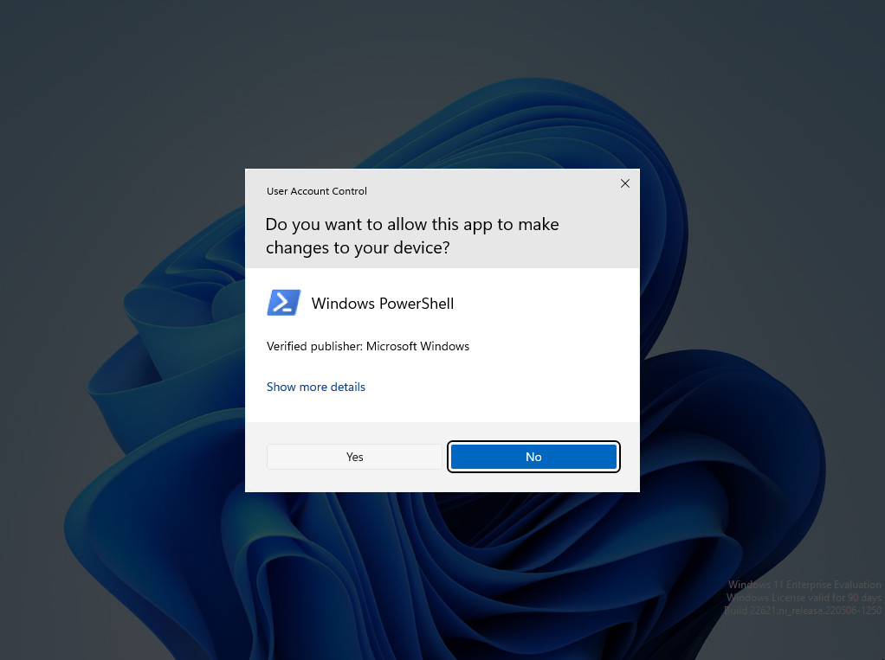

# Set Up SSH

Click the Windows button and type "powershell". Then
right click "Windows PowerShell" and select "Run as
administrator".



At the User Account Control (UAC) prompt, select "Yes".



We will install and enable OpenSSH server as described
in the [Microsoft
Documentation](https://learn.microsoft.com/en-us/windows-server/administration/openssh/openssh_install_firstuse?tabs=powershell).
In the PowerShell prompt, run:

```powershell
Add-WindowsCapability -Online -name OpenSSH.CLIENT~~~~0.0.1.0
```

Next, in the PowerShell prompt, run:

```powershell
Add-WindowsCapability -Online -name OpenSSH.Server~~~~0.0.1.0
```

Note that if this command fails with an error code, you
may need to disconnect from any connected VPN/proxy on
the host machine then restart the guest virtual
machine, [or set up the proxy on the guest virtual
machine](https://support.microsoft.com/en-us/windows/use-a-proxy-server-in-windows-03096c53-0554-4ffe-b6ab-8b1deee8dae1#ID0EFD=Windows_10).

Then, run:

```powershell
Start-Service sshd
Set-Service -name sshd -StartupType 'Automatic'
```
