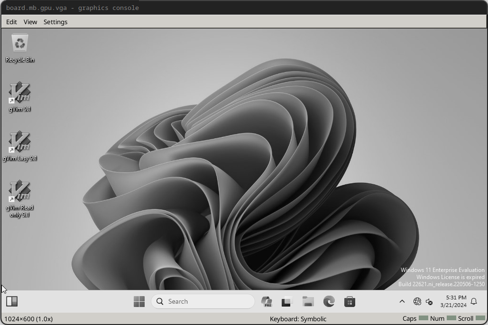

# Create a Project

Now that we have a disk image, we'll create a project for fuzzing our Windows machine.

From the root of this repository:

```sh
cd examples/tutorials/windows-kernel
ispm projects . --create 1000-latest 2096-latest 8112-latest 1030-latest 31337-latest --ignore-existing-files
```


Make sure `windows-11.craff` is in the project directory. Then, create a script `run.simics`. Before we start fuzzing, we'll need to let Windows set itself up on the new simulated hardware.

`run.simics` should look like this:

```simics
$cpu_comp_class = "x86QSP2"
$disk0_image = "%simics%/windows-11.craff"
$use_vmp = FALSE
$create_usb_tablet = TRUE

run-command-file "%simics%/targets/qsp-x86/qsp-hdd-boot.simics"
```

Run the system with the command below. Remember that the simulated system will be much
slower than the virtualized system, especially as we will run with VMP disabled.

```sh
./simics ./run.simics
```

Then, in the Simics command line:

```simics
run
```

The system will begin booting. The boot process may take a significant amount of time
and the system may reboot. Wait until the system runs all the way through boot. In some
cases, the automatic login we set may not take effect.  Wait until you either log in
automatically to the desktop or until you see the login window below. This is a good
time to make another coffee!


If you are not automatically logged in, type your password (slowly) and press enter to log in. Be sure to wait until the taskbar appears (it typically loads last).

After logging in, press control+c on the Simics command line to pause execution. The `board.mb.gpu.vga` screen should turn greyscale like below.



Then, run:

```simics
board.disk0.hd_image.save-diff-file filename = "windows-11.diff.craff"
```

This will save a diff between the current image state and our initial state, which will allow us to skip the long process of Windows driver reinitialization.

Next, we will add a line to `run.simics` to load the diff file from the saved diff.

```
board.disk0.hd_image.add-diff-file filename = "windows-11.diff.craff"
```

Most likely, the registry settings for automatic login and the scheduled task we set up will not be working. This is OK! We can re-enable them. Unfortunately, we will need
to use the GUI to do so, which can be very slow. Patience is a benefit here.

Open a powershell prompt in the Simics guest and run:

```powershell
simics_agent_x86_win64.exe
```

```powershell
schtasks /create /sc onlogon /tn "Simics Agent" /tr "C:\Users\user\simics_agent_x86_win64.exe"
reg add "HKLM\SOFTWARE\Microsoft\Windows NT\CurrentVersion\Winlogon" /v AutoAdminLogon /t REG_SZ /d 1 /f
reg add "HKLM\SOFTWARE\Microsoft\Windows NT\CurrentVersion\Winlogon" /v DefaultUserName /t REG_SZ /d "user" /f
reg add "HKLM\SOFTWARE\Microsoft\Windows NT\CurrentVersion\Winlogon" /v DefaultPassword /t REG_SZ /d "password" /f
```


## Connect to Agent