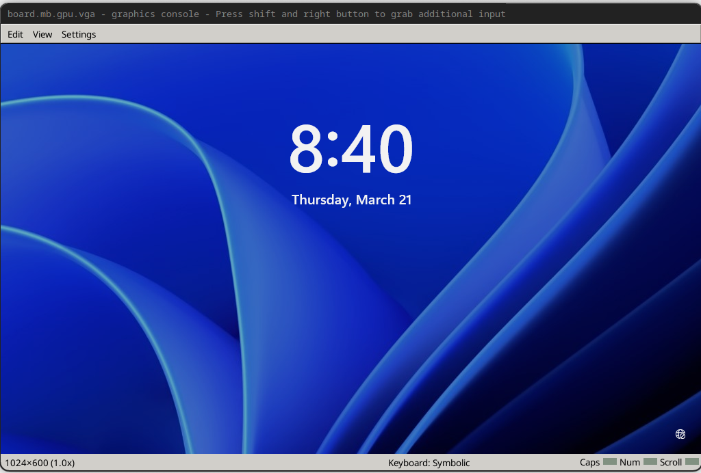
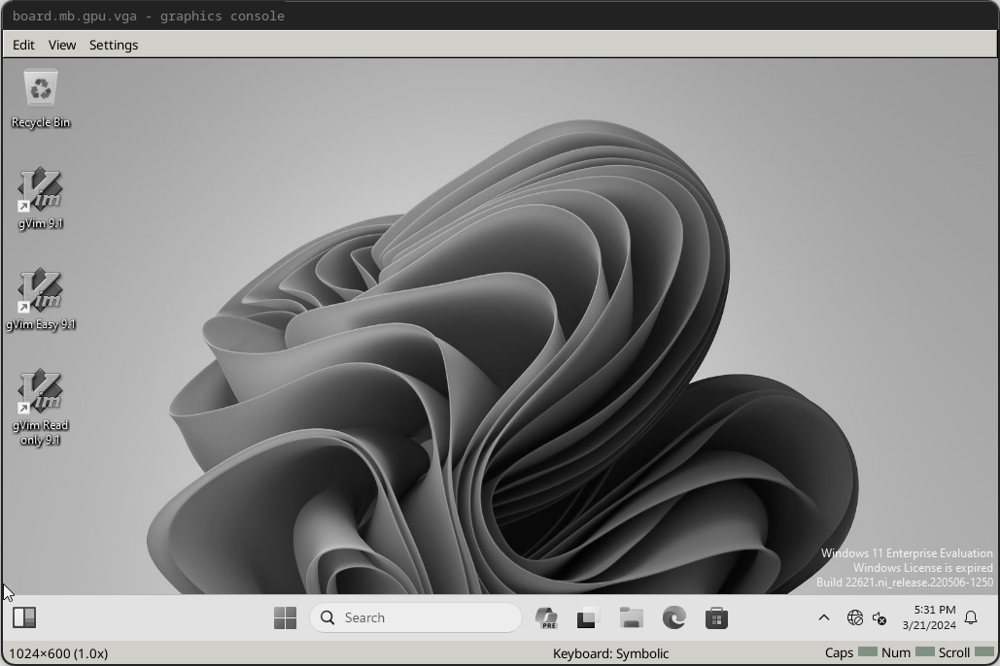

# Run the Simulation


Run the system with the command below. Remember that the simulated system will be much
slower than the virtualized system, especially as we will run with VMP disabled.

```sh
./simics ./run.simics
```

Then, in the Simics command line:

```simics
run
```

The system will begin booting. The boot process may take a significant amount of time
and the system may reboot. Wait until the system runs all the way through boot. In some
cases, the automatic login we set may not take effect.  Wait until you either log in
automatically to the desktop or until you see the login window below. This is a good
time to make another coffee!



If you are not automatically logged in, type your password (slowly) and press enter to log in. Be sure to wait until the taskbar appears (it typically loads last).

After logging in, press control+c on the Simics command line to pause execution. The `board.mb.gpu.vga` screen should turn greyscale like below.



Then, run:

```simics
board.disk0.hd_image.save-diff-file filename = "windows-11.diff.craff"
```

This will save a diff between the current image state and our initial state, which will allow us to skip the long process of Windows driver reinitialization.

Next, we will add a line to `run.simics` to load the diff file from the saved diff.

```
board.disk0.hd_image.add-diff-file filename = "windows-11.diff.craff"
```

## Connect to Agent

We'll create an agent manager in the Simics CLI:

```simics
start-agent-manager
```

You should see:

```txt
'agent_manager' is created and enabled.
```

Then we'll run:

```simics
agent_manager.connect-to-agent 
```

After which you should see:

```txt
matic0:job 0 (connect-to)
[matic0 info] connected to DESKTOP-QNP1C9S0
```

Now we can run commands on the guest from the Simics command line. We want run
our fuzz driver program.

```simics
matic0.run "C:\\users\\user\\fuzzer\\fuzzer.exe"
```

The fuzzer will start when the harness executes, and fuzzing will commence.

