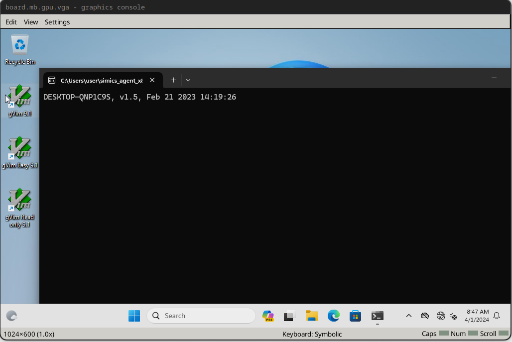
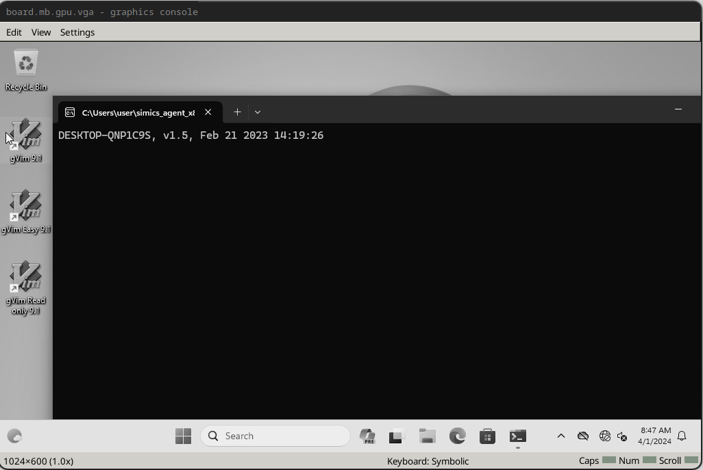
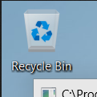
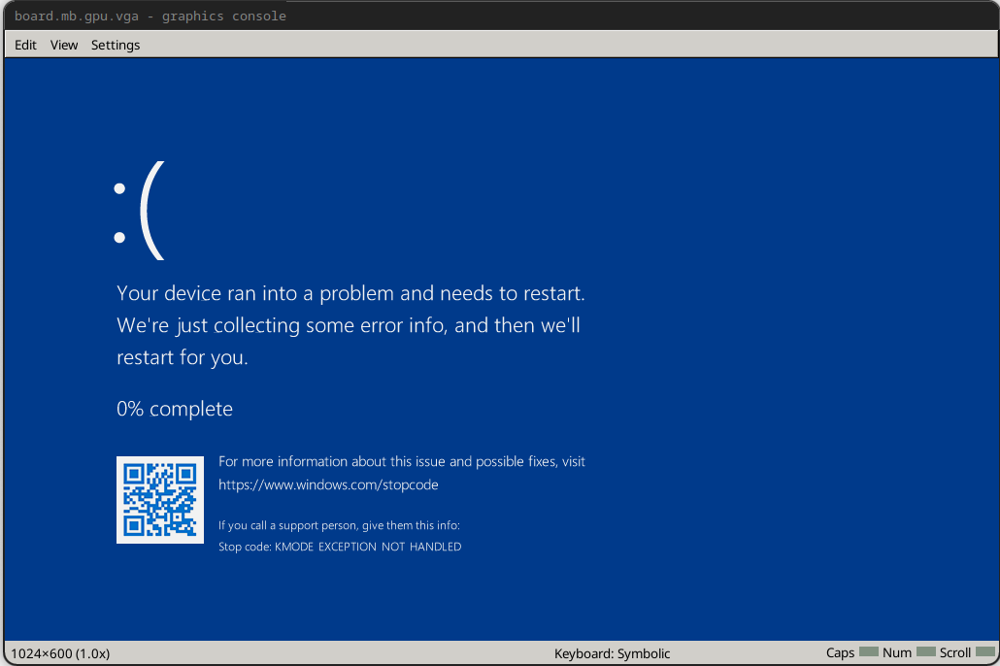

# Run the Simulation


Run the system with the command below. Remember that
the simulated system will be much slower than the
virtualized system, especially as we will run with VMP
disabled.

```sh
./simics ./run.simics
```

Then, in the Simics command line:

```simics
run
```

The system will begin booting. The boot process may take a significant amount of time
and the system may reboot. Wait until the system runs all the way through boot. Wait
until after you are automatically logged into the system and the Simics agent command
window is open. This is a good time to make another coffee!



At this point, if the mouse cursor is visible on the guest, move it to the taskbar.
Then, After being logged in, press control+c on the Simics command line to pause
execution. The `board.mb.gpu.vga` screen should turn greyscale like below.



Then, run:

```simics
board.disk0.hd_image.save-diff-file filename = "windows-11.diff.craff"
```

This will save a diff between the current image state and our initial state, which will
allow us to skip the long process of Windows driver reinitialization.

Next, we will add a line to `run.simics` to load the diff file from the saved diff. This
will speed up subsequent boots of the system significantly.

```simics
board.disk0.hd_image.add-diff-file filename = "windows-11.diff.craff"
```

Then, we will save a graphical breakpoint which will allow us to wait in the boot
process until login is complete and the system is logged in and ready to run Agent
commands.

In the Simics cli, run:

```simics
board.console.con.status
```

This will display graphical console information like:

```simics
Status of board.console.con [class graphcon]
============================================

Mouse:
            Absolute positioning : True
         Absolute pointer device : board.tablet.usb_tablet

Grab:
                    Mouse button : right
                        Modifier : shift

VNC:
                            Port : none
                     UNIX socket : none
                       Listening : False
                     Connections : 0

Screen:
             Size width x height : 1024x600
    Refresh rate (Hz, real time) : 50
```

Note the screen width and height. We will not capture the entire screen, only the very
top left -- enough to conclude the system is booted but not enough to capture any time
data.

To determine the size of screenshot we need, we'll save the screen to a PNG with:

```simics
board.console.con.screenshot filename = screenshot.png
```

Then, we can crop it on the command line with ImageMagick (`dnf -y install ImageMagick`)
and examine the result:

```sh
convert screenshot.png -crop 80x80+0+0 cropped.png
```

Then, check the screenshot in your favorite viewer (a web browser works conveniently for
this), e.g.:

```sh
firefox cropped.png
```

In this case, we want to see the desktop and the CMD window that tells us the Simics
agent is running. Importantly, we do *not* want to see the time printed by either the
Simics agent at startup, or the time on the taskbar (or anything else that could change
from run to run).



With our graphical breakpoint size decided, we can save our boot breakpoint:

```simics
board.console.con.save-break-xy breakpoint-boot 0 0 80 80
```

This will save a graphical capture of the graphical console containing the top left of
the displayed screen (enough to capture the booted desktop and CMD prompt window, and
exclude the time in the taskbar and CMD prompt).

We will then resume the simulation by running (in the Simics CLI):

```simics
continue
```

Allow the simulation to run for a few seconds to tick the clock, then pause it again
by entering Ctrl+C.

Check that the breakpoint is valid by running:

```simics
board.console.con.gfx-break-match breakpoint-boot
```

You should see:

```simics
TRUE
```

## Connect to Agent

Next, we'll create an agent manager in the Simics CLI:

```simics
start-agent-manager
```

You should see:

```txt
'agent_manager' is created and enabled.
```

Then we'll run:

```simics
agent_manager.connect-to-agent 
```

After which you should see:

```txt
matic0:job 0 (connect-to)
[matic0 info] connected to DESKTOP-QNP1C9S0
```

Now we can run commands on the guest from the Simics command line. We want run
our fuzz driver program.

```simics
matic0.run "C:\\Users\\user\\fuzzer\\fuzzer.exe"
```

When the fuzz driver runs, we'll get a blue screen:



This is because we just submitted a buffer of size 4096 (our configured maximum size)
and overflowed the stack of the driver process, corrupting it. This means all is working
correctly and we can move on to fuzzing the driver. Note that when we start up the
fuzzer, it will not immediately cause the same blue screen because it will start with a
random corpus of small inputs.
