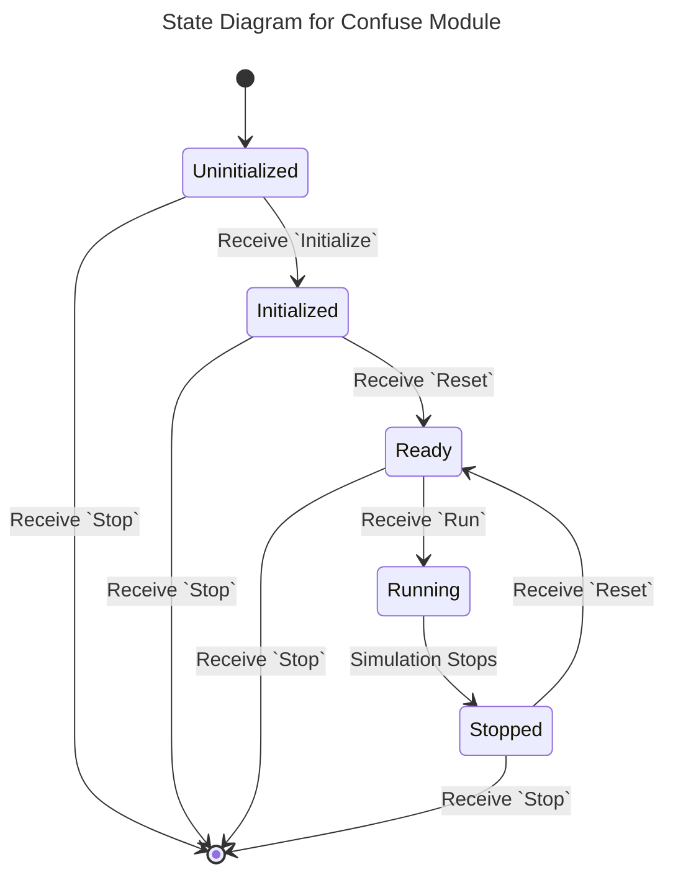

```mermaid
---
title: State Diagram for Confuse Module
---
stateDiagram-v2
    [*] --> Uninitialized
    Uninitialized --> Initialized: Receive `Initialize`
    Uninitialized --> [*]: Receive `Stop`
    Initialized --> Ready: Receive `Reset`
    Initialized --> [*]: Receive `Stop`
    Ready --> Running: Receive `Run`
    Ready --> [*]: Receive `Stop`
    Running --> Stopped: Simulation Stops
    Stopped --> Ready: Receive `Reset`
    Stopped --> [*]: Receive `Stop`

```